# Beat Saber マッピング用語集 (WIP)

日本人向けの、Beat Saberのマッピング（譜面制作）に特化した用語集です。 
配置用語なども含みますので、マッピングをしていないプレイヤーも参考になると思います。 
!!! info ""
    これは、私toroが個人的に作成した用語集です。内容について何かあればページ下部の連絡先からお気軽にご連絡ください。 
    プレイヤー目線での一般的なBeat Saber用語が知りたい方は、hibitさんが作成している「<a href="https://docs.google.com/document/d/1Zl8jh0djB80o3tbTmGR1MF9gV9pkYPfxqTC4IuRQmd0/edit?usp=sharing" target="_blank">ビーセイゆるふわ用語集</a>」もおすすめです。

## ア行

| 用語 | 意味 |
| --- | --- |
| **アーク** <small>*Arc*</small> | ノーツ間を繋ぐ光る曲線。主に長い音を<a href="#表現">表現</a>する為に使用される。線自体に判定はなく、接続したノーツのスコアリングを変化させる。 <a href="https://note.com/toro_desu/n/n095e2d66015c" target="_blank">解説記事</a> 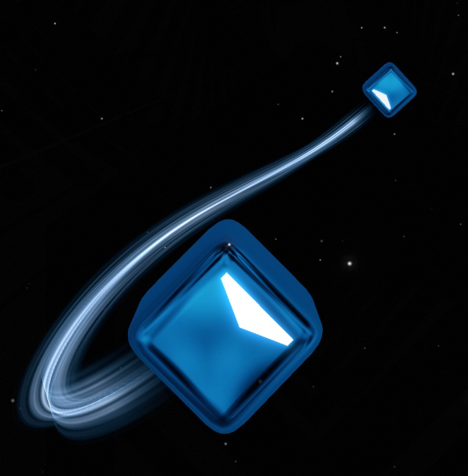 |
| **ArrowVortex** <small>*アローボルテックス*</small> | 曲のBPMを検出し、必要な<a href="#オフセット">オフセット</a>値を決定するために使われる定番ソフト。元々は他音楽ゲーム用の作譜ツールである。 |
| **Unlit bomb** <small>*アンリットボム*</small> | ライトが消灯（または弱い）していて暗くて見えづらい状態のボムのこと。ボムは黒色なので、ライトがなければ暗い背景に同化して思わぬボム接触を誘発してしまう。 基本的にはボムがある箇所よりも手前でライトを十分に点灯させておき、ボムを視認しやすくすべきである。 ランク基準では明確な修正対象。 |
| **eBPM** <small>*イービーピーエム*</small> | 譜面のノーツ間隔から算出される、「実質的なスイング速度」。 曲のBPMが同じでも、要求される腕の振りの速さはノーツ配置によって異なる為、それをわかりやすく示す為のBeat Saber固有の指標である。effective BPMの略。 片手でダウン・アップと連続で切る配置において、ノーツ間隔が「1/2ビート」の時、スイング速度eBPMは「その曲のBPM」と一致し、これが基準（等倍）となる。 ・1/4ビート間隔の場合：eBPMは2倍（スイングは倍の速さ） ・1/1ビート間隔の場合：eBPMは半分（スイングはゆっくり） ざっくり言えば、120BPMの曲で1/4間隔のノーツを置いた場合、それは240BPMの曲の難しさとイコールになるという考え方である。 |
| **一貫性** <small>*Consistency*</small> | 譜面全体を通して、同じような音やフレーズに対して同じパターンの配置やルールを適用すること。譜面品質を上げる為の考え方のひとつ。 |
| **イベント** <small>*Event*</small> | 譜面データにおけるノーツ配置以外の要素、ライティングやEnvironmentギミック（リング等）、BPM変更などの命令単位。 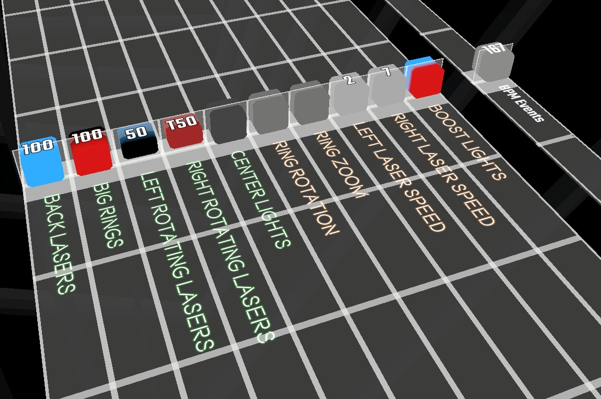 |
| **インバース** <small>*Invert*</small> | 上段に置かれた下向きノーツや、右端に置かれた左向きノーツなど、位置と矢印の関係が逆になっている配置。プレイヤーにより大きな動きをもたらす。英語ではInvert。 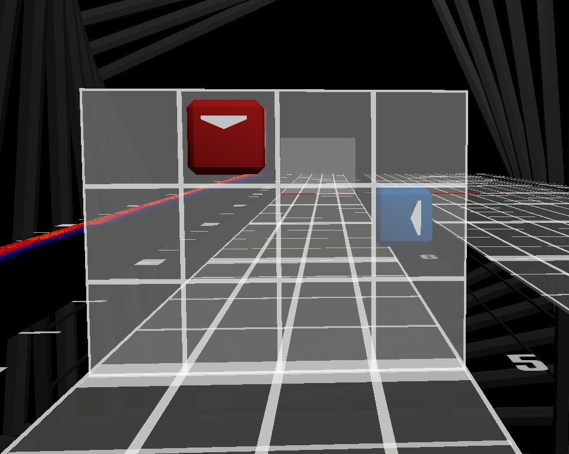 |
| **info.dat** <small>*インフォダット*</small> | 譜面に含まれる設定ファイル。曲名、マッパー名、BPM、難易度情報など、譜面の基本情報（メタデータ）がすべて記述されている。 難易度ファイルと同様、info.datにもバージョンが存在し、<a href="#V4マップ">V4マップ</a>ではinfo.datの仕様も大きく変更されている。 |
| **インライン** <small>*Inline*</small> | ノーツを同じレーンに一列に配置すること。 後続のノーツはほとんどが隠れる為、リズムを合わせるのがとても難しい。また、矢印は完全に見えなくなる為、後続のノーツの向きは揃えるか、確実に予測可能であるものが望ましい。 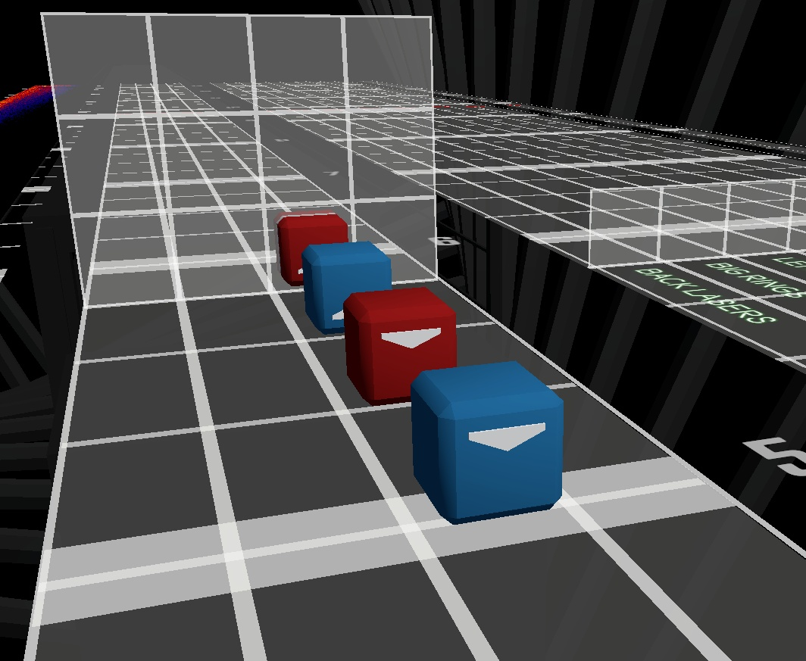 |
| **Vivify** <small>*ヴィヴィファイ*</small> | AssetBundleを譜面で使用可能にするMod。マッパーは各種アセット（3Dモデル、画像、ポストプロセス・シェーダー等）を用意し、譜面の中で使用できる。 <a href="#Chroma">Chroma</a>、<a href="#NoodleExtensions">NoodleExtensions</a>に並ぶ、譜面の拡張Mod。 |
| **WIP** <small>*ウィップ*</small> | 譜面が「作成途中」であること。Work-In-Progressの略。 <a href="#ChroMapper">ChroMapper</a>や<a href="#公式エディタ">公式エディタ</a>で譜面を作成すると自動的にwip専用のフォルダ「CustomWIPLevels」に配置される。 |
| **wipbot** <small>*ウィップボット*</small> | 配信者に!wipコマンドでwip譜面をリクエストすることができるMod。譜面はwipbotサーバーにアップロードするか、discordかGoogleドライブのリンクを使うことでリクエストできる。 リクエストを受ける側がModを導入しておかないと使えない点に注意しよう。Beat Saber配信者はこのModを入れておくと助かるマッパーがいるかもしれない。 <a href="https://github.com/Danielduel/wipbot" target="_blank">https://github.com/Danielduel/wipbot</a> |
| **ウィンドウ** <small>*Window*</small> | タワーノーツから真ん中を抜いた配置。<a href="#タワー">タワー</a>の見た目の圧を和らげたり、<a href="#ビジョンブロック">ビジョンブロック</a>を回避する目的などで用いられる。 画像の青ノーツのように、斜めのウィンドウはノーツ角度が自動で調整され一直線の配置になる。 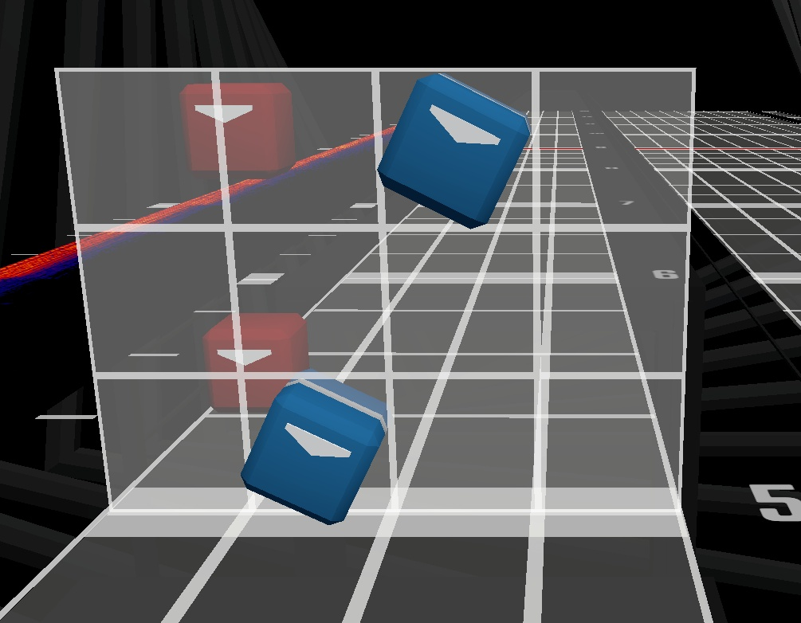 |
| **ウィンドウスライダー** <small>*Window Slider*</small> | 3個連なる<a href="#スライダー">スライダー</a>から真ん中のノーツを抜いたもの。 ずらし間隔は真ん中にノーツがある想定で決定する。 例: スライダーを1/32間隔にしている場合、ウィンドウスライダーでは1/16ぶんずらして配置する。 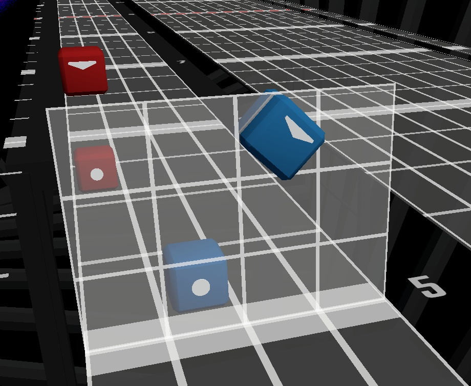 |
| **ウォールアート** <small>*Wall Art*</small> | <a href="#NoodleExtensions">NoodleExtensions</a>や<a href="#MappingExtensions">MappingExtensions</a>を利用し、「壁」を自在に配置して文字や絵、建造物などの視覚演出を作ったもの。 |
| **HJD** <small>*エイチジェーディー*</small> | ノーツが<a href="#スポーン">スポーン</a>してからプレイヤーの元に到達するまでのビート数(拍数)。ノーツの表示タイミングを決める譜面の設定値。Half-Jump-Durationの略。 関連: <a href="#JD">JD</a>、<a href="#リアクションタイム">リアクションタイム</a>、<a href="#HJDライン">HJDライン</a> |
| **HJDライン** <small>*HJD Line*</small> | <a href="#ChroMapper">ChroMapper</a>や<a href="#公式エディタ">公式エディタ</a>において、<a href="#HJD">HJD</a>の位置に表示される赤いラインのこと。 HJDラインは「ノーツが<a href="#スポーン">スポーン</a>するタイミング」を示すため、これを目安にすれば、<a href="#ビジョンブロック">ビジョンブロック</a>の対象となるタイミングを明確に区別しながらマッピングできる。 例えば、右側に<a href="#フェイスノーツ">フェイスノーツ</a>や壁よけを置いた場合、その時点からHJDラインまでは「ノーツが現れている時間」となる。そのため、その区間の右半分にノーツを置くとビジョンブロックになってしまう。よって、「ビジョンブロックを回避するには、HJDラインより後の位置に置けばよい」と簡単に判断できる。 ※この考え方は、譜面難易度に合わせた適切な<a href="#リアクションタイム">リアクションタイム</a>が設定されていることが大前提である。 なお、ChroMapperには、HJDの位置に薄い壁を表示する「<a href="https://github.com/rynan4818/ChroMapper-HalfJumpDurationMark" target="_blank">HalfJumpDurationMark</a>」というプラグインも存在する（機能としてはこちらが先）。 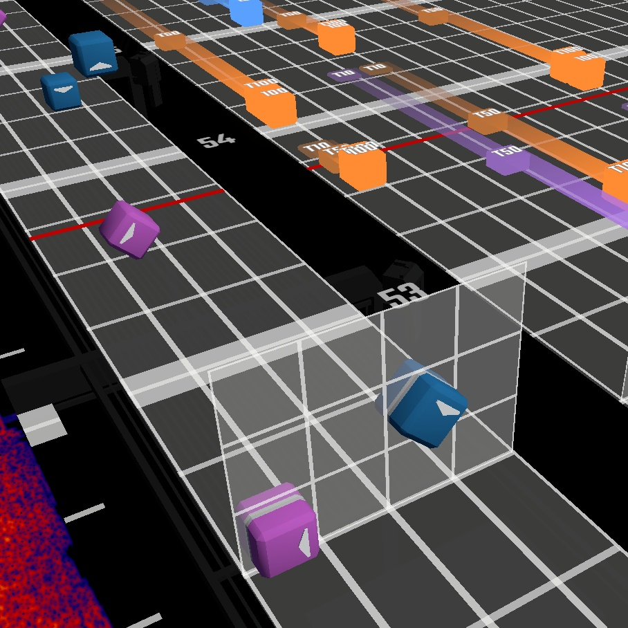 |
| **AIマップ** <small>*エーアイマップ*</small> | Beat Sageなどのツールを使い、音源から自動生成した譜面。お世辞にも品質が良いとは言えない譜面ができあがる。 <a href="#BeatSaver">BeatSaver</a>に公開することは基本推奨されておらず、どうしても公開する場合はタグ付けが必須である（デフォルトで検索非表示）。 |
| **Acc** <small>*エーシーシー、アック、アキュラシー*</small> | ① 高い精度を出すことに特化した譜面ジャンルのこと。ノーツ密度は低めでフルコンボ前提であり、精度を狙いやすい配置パターンで構成される。精度譜面。 ② Accuracy（<a href="#精度">精度</a>）の略称 |
| **SPS** <small>*エスピーエス*</small> | 1秒間あたりの腕の振り（スイング）の平均回数。Swings Per Secondの略。 <a href="#NPS">NPS</a>（秒間ノーツ数）とは異なり、<a href="#スタック">スタック</a>や<a href="#スライダー">スライダー</a>などの複数ノーツを切る場合は1スイングとして計算されるため、「実際のスイングの忙しさ」をより正確に表す指標である。 |
| **NJS** <small>*エヌジェーエス*</small> | ノーツがプレイヤーに向かって飛んでくる速度。メートル毎秒。 プレイヤーが変更できない数値である為、マッパーは難易度に合わせて適切に値を決める必要がある。Note Jump Speedの略。 |
| **NPS** <small>*エヌピーエス*</small> | 1秒間あたりのノーツ平均数。譜面の大まかなノーツ密度・難易度の目安となる。Notes Per Secondの略。 |
| **FPFC** <small>*エフピーエフシー*</small> | VRヘッドセットを被らずに、PCのモニター上でマウスとキーボードを使ってゲーム内を自由に移動・確認できるモード。ゲームの起動オプションに「fpfc」と入れるか、<a href="#BSManager">BSManager</a>でモード選択することで使用できる。 First Person Full Camera、またはFirst Person Flying Controllerの略（指すものは同じ）。 |
| **MMA2** <small>*エムエムエーツー*</small> | 過去に主流だった非公式マッピングエディタ。Mediocre Map Assistant 2の略。 もう何年も更新が止まっていて配布も終了した為、現在は<a href="#ChroMapper">ChroMapper</a>が推奨される。 |
| **Environment** <small>*エンバイロメント*</small> | 譜面のプレイ背景となるステージ環境。Environmentごとにライトの形や挙動、その他造形物などのデザイン、ライティングシステムが異なる。 ≒<a href="#プラットフォーム">プラットフォーム</a> 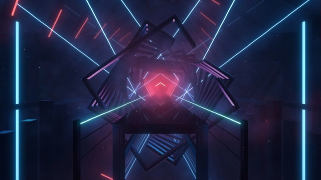 |
| **Environment Enhancement** <small>*エンバイロメントエンハンスメント*</small> | <a href="#Chroma">Chroma</a>による、<a href="#Environment">Environment</a>を改造する機能。既存のオブジェクトを消したり、大きさを変えたり、別の場所に移動させたりして、既存Environmentのちょっとしたアレンジから、<a href="#ジオメトリ">ジオメトリ</a>なども活用して完全独自のEnvironmentを作り上げることもできる。 |
| **オートライト** <small>*Auto Light*</small> | ツールを使って自動生成されたライト。<a href="#ChroMapper">ChroMapper</a>プラグインの<a href="https://github.com/Loloppe/ChroMapper-AutoMapper" target="_blank">AutoMapper</a>、<a href="https://github.com/Jonas00000/ChroMapper-AutoLighterV2" target="_blank">AutoLighterV2</a>が現在よく使われるオートライトである。ライティングを作るのがしんどい時の強い味方。 手作業で作成したライトは「マニュアルライト」と呼ばれる。 |
| **オーバーマッピング** <small>*Overmapping*</small> | 曲の音数以上にノーツを配置すること。リズムゲームである以上、音を伴わないノーツを置くことは（特殊な譜面を除き）非推奨である。 ランク基準やキュレーション基準では明確に禁止されている。 |
| **ogg** <small>*オッグ*</small> | 一般的な音声ファイルの拡張子（.ogg形式）。Beat Saberの譜面でもoggが使用されている。 <a href="#BeatSaver">BeatSaver</a>に譜面をアップロードすると、音声ファイルは自動的にeggという独自形式（中身はogg）に変換される。 |
| **音取り** <small>*Rhythm Choice*</small> | 曲の中のどの音（メロディ、ドラムなど）をノーツの配置対象として拾うかを選択すること。 |
| **Obstacle** <small>*オブスタクル*</small> | 壁（Wall）の別名。ゲーム公式の名称である為、Modやツールでも壁をObstacleと表記していることが多い。とはいえ、もちろんWallと呼ばれることも多い。 |
| **オフセット** <small>*Offset*</small> | 音源の頭の無音時間を調整し、エディタのビートラインと曲のビートを正確に合わせること。オーディオオフセット。 ※ゲーム設定でセイバーの位置・角度を調整するのはセイバーオフセット |

## カ行

| 用語 | 意味 |
| --- | --- |
| **回転配置** <small>*Arm Circle*</small> | 腕や手を円を描くように回して連続で切らせる配置パターン。回転の勢いに乗せて角度変化を加えたものを回転テックとも言う。  関連: <a href="#モメンタム">モメンタム</a> ※画像は一例 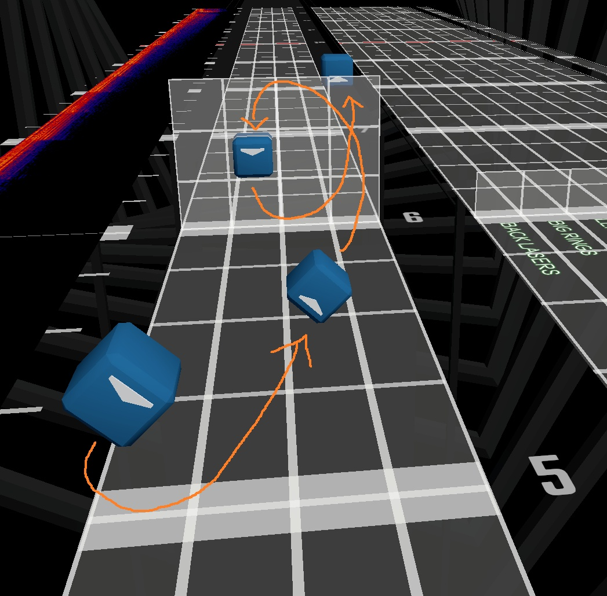 |
| **カスタムカラー** <small>*Custom Song Colors*</small> | 譜面に設定される独自の配色設定。ノーツ・壁・ライトの配色を、デフォルトの<a href="#Environment">Environment</a>依存の色ではなく、マッパーが自由に指定できる機能。 元々は<a href="#SongCore">SongCore</a>によって機能する非公式のものだったが、「Color Scheme」という名称で公式のカスタムカラーも実装された。できることは両者ほぼ一緒であり、<a href="#ChroMapper">ChroMapper</a>ではSongCoreのカスタムカラーが、<a href="#公式エディタ">公式エディタ</a>では公式のカスタムカラーがデフォルトで使用できる（公式カスタムカラーは「ホワイト」の変更ができない）。  ※カスタムカラーで変更できるのは「配色のカラーセット」であり、オブジェクト単位で色を変更できる<a href="#Chroma">Chroma</a>はまた別物 |
| **Custom Json Data** <small>*カスタムジェイソンデータ*</small> | 譜面のデータ（JSON）に、Modで使用する独自情報（Custom Data）を追加し、利用する為のライブラリMod。<a href="#Chroma">Chroma</a>や<a href="#NoodleExtensions">NoodleExtensions</a>などの情報は譜面のCustom Data領域に記録される。 |
| **カバー画像** <small>*Cover Art/Image*</small> | 譜面のジャケット画像のこと。大抵の場合はその曲のジャケット画像が用いられる。 画像は正方形でなくてはならず、最低256x256、大きくとも512x512に抑えるべきである。画像データはゲーム中のPCのメモリに蓄積し続ける為、大きい画像は絶対にリサイズしよう。 <a href="#BeatSaver">BeatSaver</a>ではNSFWなカバー画像にはボカシがかけられる場合がある。露骨な場合は規約違反で削除対象となるので、頭の片隅に入れておこう。 |
| **壁** <small>*Wall*</small> | 壁の障害物。頭が当たるとダメージを受けコンボが途切れる。プレイヤーは身体を動かして避ける必要がある。頭以外に判定は無く、セイバーが触れても問題ない。 マッピングにおいては、避けさせる目的で配置するほか、外レーンや<a href="#V3ウォール">V3ウォール</a>などで音を<a href="#表現">表現</a>するだけの飾りの壁としても用いられる。 |
| **壁よけ** <small>*Dodge Wall*</small> | ＝<a href="#ドッジウォール">ドッジウォール</a> または、壁を避ける行為そのもの。 |
| **可変BPM** <small>*Variable BPM*</small> | 1曲の中でBPMが変化すること。マッピングするには都度BPM<a href="#イベント">イベント</a>を置いて調整することになる。 |
| **ギミック** <small>*Gimmick*</small> | 標準的なセオリー（定番パターンや、時には<a href="#パリティ">パリティ</a>など）からあえて外れて、プレイヤーに特定の「特殊な動き」や「攻略要素」を要求する変則的な配置や仕掛け。特定のギミックをコンセプトとしてデザインされた譜面はギミック譜面とも呼ばれる。 ※かなりふんわりしたニュアンスの用語である為、「斬新なアイデアの配置・譜面」ぐらいのイメージでよい |
| **Characteristic** <small>*キャラクタリスティック*</small> | Standardや<a href="#OneSaber">OneSaber</a>など、譜面の<a href="#ゲームモード">ゲームモード</a>（難易度の大分類）のこと。 ・公式のCharacteristic:  Standard、OneSaber、<a href="#No Arrows">No Arrows</a>、<a href="#360度譜面">360 Degree</a>、<a href="#90度譜面">90 Degree</a>、<a href="#Legacy">Legacy</a> ・非公式のCharacteristic（<a href="#SongCore">SongCore</a>によって機能）:  <a href="#Lightshow">Lightshow</a>、<a href="#Lawless">Lawless</a> Characteristic名称とラベルアイコンは自由に変更できる（SongCoreの機能）。 |
| **ギャロップ** <small>*Gallop*</small> | 赤→青、または青→赤の直後に同時切りを置く一連のパターン。特に、1/4間隔などの速い速度で配置されたものを指す（<a href="#ストリーム">ストリーム</a>の最後を同時切りにしたものも該当）。 見た目以上の難度、<a href="#強調">強調</a>を生む配置であるため扱いには注意が必要である。 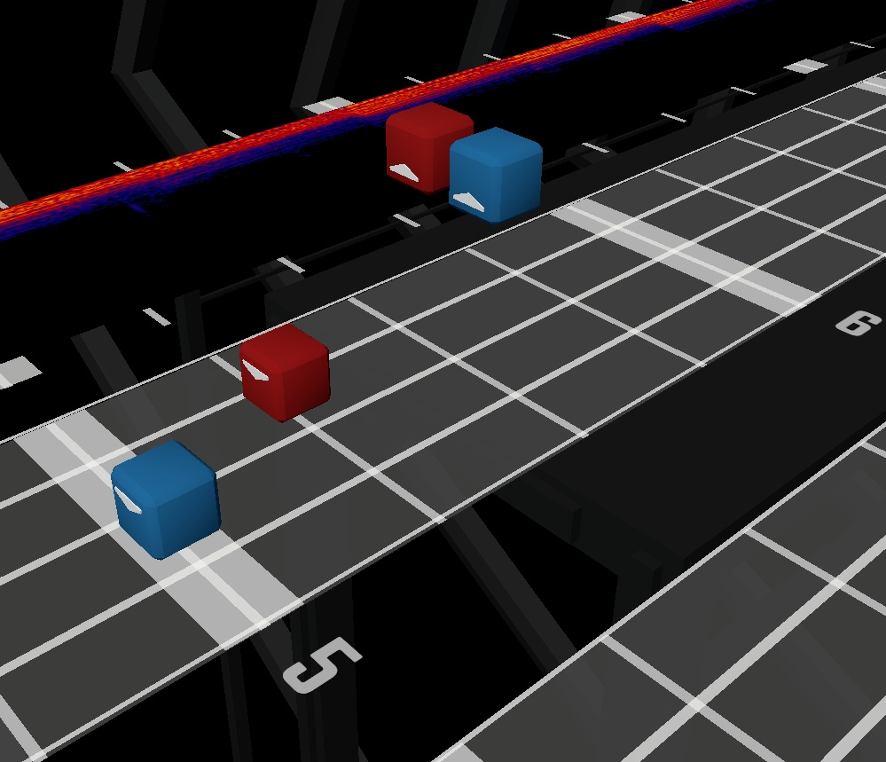 |
| **90度譜面** <small>*90 Degree Map*</small> | プレイヤーを中心に、左右90度の範囲で様々な方向からノーツが飛んでくる公式の<a href="#ゲームモード">ゲームモード</a>。90 Degree。 正面以外からもノーツが飛んでくるので、プレイヤーは視野を広げて身体の向きを変えながらプレイする。難易度は高いが、<a href="#360度譜面">360度譜面</a>よりは角度が限定的なので遊びやすい。 |
| **キュレーター** <small>*Curator*</small> | <a href="#キュレート">キュレート</a>を行う専門の人たち。<a href="#BeastSaber">BeastSaber</a>によって運営され、人員は一般公募で募集される（審査あり）。不定期で追加募集がかかるので気になる人はBeastSaberのdiscordサーバーをチェックしておこう。 キュレーションチーム: <a href="https://bsaber.com/curation-team" target="_blank">https://bsaber.com/curation-team</a> |
| **キュレート** <small>*Curation*</small> | <a href="#BeatSaver">BeatSaver</a>にある膨大なカスタム譜面の中から、品質の高い譜面や面白い譜面を「おすすめ」としてピックアップする仕組み。キュレートされた譜面はBeatSaver上で緑色の帯がつく。キュレーションとも。 キュレートは専門の<a href="#キュレーター">キュレーター</a>が行う。 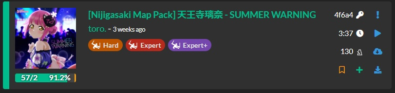 |
| **強調** <small>*Emphasis*</small> | 曲の強い音や特徴的なフレーズに合わせて、ノーツ配置の強さを上げたり動きを大きくするなどして「目立たせること」。楽曲との一体感を高める為の普遍的なマッピング技術のひとつ。 関連: <a href="#一貫性">一貫性</a> |
| **クラッシュ** <small>*Clash*</small> | 左右のコントローラーが物理的に衝突してしまうこと。またはそれを誘発する危険なノーツ配置（クラッシュ配置）。基本的にはマッパーはそれを避けるべきである。 ≒<a href="#ハンドクラップ">ハンドクラップ</a> |
| **クロス** <small>*Crossover*</small> | 赤青の並びが反対位置に置かれていて、手（セイバー）を交差させながら切らせる配置。クロスオーバーとも。 クロスの間隔が広くなるほど<a href="#クラッシュ">クラッシュ</a>の危険性が上がる為プレイヤーもマッパーも注意しよう。 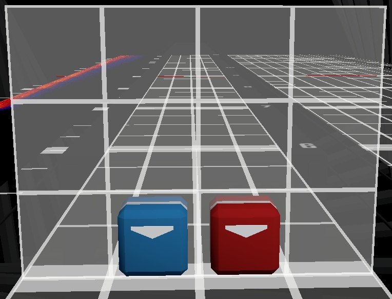 |
| **クロスシザー** <small>*Crossover Scissor, Pickle*</small> | <a href="#シザー">シザー</a>配置を、左右クロスで配置したもの。<a href="#クラッシュ">クラッシュ</a>しやすい配置なので<a href="#セットアップ">セットアップ</a>に気をつけよう。 海外ではピクルス(Pickle)と呼ばれる場合もある。 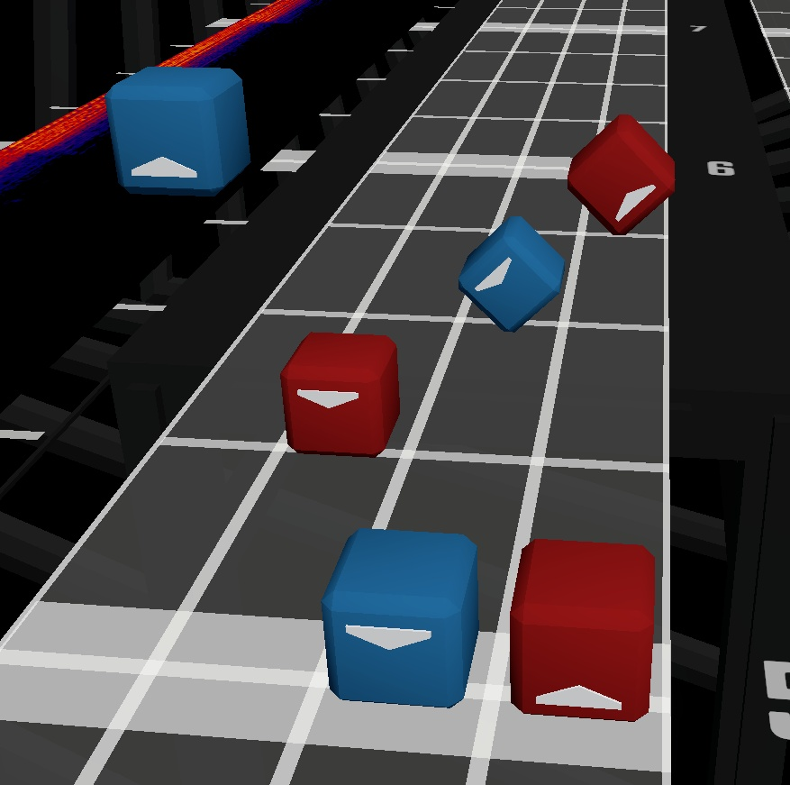 |
| **Chroma** <small>*クロマ*</small> | ライト・壁・ノーツの色を自由に変更したり、リングやレーザーを細かく制御、<a href="#Environment">Environment</a>を改造したりできるライティング拡張Mod。ライト<a href="#表現">表現</a>の幅を大きく広げる。 <a href="#カスタムカラー">カスタムカラー</a>とは違い、Chromaはカラーセットの変更ではなく、ノーツやライトイベントを「1個単位で」自由に色を指定できる（色の反映はカスタムカラーよりも優先される）。 |
| **ChroMapper** <small>*クロマッパー*</small> | コミュニティで広く使われている高性能な非公式マッピングエディタ。現代のスタンダード。 |
| **ゲームモード** <small>*Game Mode*</small> | Standard、<a href="#OneSaber">OneSaber</a>、360度など、譜面がもつ難易度の大分類。<a href="#Characteristic">Characteristic</a>。 |
| **公式エディタ** <small>*Official Editor*</small> | ゲーム内に組み込まれている公式機能のマッピングエディタ。2026/4現在、<a href="#V3ライティング">V3ライティング</a>の作成は公式エディタでのみ対応している。 ゲームのホーム画面下のボタンから起動できる（fpfcモード推奨）。または、起動オプションに「editor」を入力するか、<a href="#BSManager">BSManager</a>の「Map Editor」オプションをオンにすることで直接起動できる。 |
| **コールドエンド** <small>*Cold End*</small> | 曲の終わり、最後のノーツ・ボム・壁よけから曲が終了するまでの時間が短すぎること。余韻なく急に終わる印象を与えてしまう。 ランク基準では最低2秒の猶予が必要。アンランクでも特別な拘りがある場合を除き2秒以上が推奨される。 |
| **コンテキスト** <small>*Context*</small> | 配置の前後関係といった「文脈」を指す。例えば、単独では不自然・奇抜なパターンでも、それまでの構成から予測・期待が可能であれば「コンテキストがある（理にかなっている）」と評価できる。 <a href="#セットアップ">セットアップ</a>や<a href="#誘導">誘導</a>を譜面全体で広く捉えた考えと言い換えてもよい。プレイ時の納得感に直結する。 |
| **混フレ** <small>*Polyrhythm*</small> | 「混合フレーズ」の略。右手と左手で全く異なるリズムやサウンドを同時に処理させる配置（音取り）。例えば左手ノーツをボーカル、右手ノーツをドラム、といったように。 ノーツ量は増えるものの、二つの音を一緒に取れる音取り手法である。音ゲー用語。 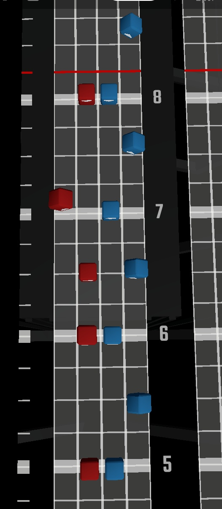 |

## サ行

| 用語 | 意味 |
| --- | --- |
| **CyberRamen** <small>*サイバーラーメン*</small> | DzRamen氏によって開発された、Beat Saber AIプレイヤー。超高精度でノーツを処理するだけでなく、「<a href="#フォアハンド">フォアハンド</a>/<a href="#バックハンド">バックハンド</a>スイング」を使った、さながらトッププレイヤーのような人間らしいスイングでプレイするのが最大の特徴。 CyberRamenへの譜面のリクエストは以下のmuffn氏のサイトから行える。リクエストすると<a href="#BeatLeader">BeatLeader</a>のリプレイデータが出力され、リーダーボードにもAIのスコアが登録されるので、ゲーム内やWeb、好きな方法でリプレイを再生できる。<a href="#WIP">WIP</a>譜面もリクエストできるので（参考になるかはさておき）<a href="#テストプレイ">テストプレイ</a>での利用も可能だ。 <a href="https://muffnlabs.de/cyberramen" target="_blank">https://muffnlabs.de/cyberramen</a> <a href="https://youtu.be/Ms4noLQ5xuQ" target="_blank">参考動画</a> |
| **360度譜面** <small>*360 Degree Map*</small> | プレイヤーの周囲360度すべての方向からノーツが飛んでくる公式の<a href="#ゲームモード">ゲームモード</a>。360 Degree。 VRらしさを最大限活用したモードだがそのぶん難易度は高い。プレイ環境によってはコードの絡まりや部屋のスペースに注意する必要がある。 |
| **JD** <small>*ジェーディー*</small> | ノーツが出現してからプレイヤーに到達するまでの物理的な距離。Unity空間におけるメートル（unit）換算で、1JD=0.5m。ジャンプディスタンスの略。ジャンプ距離とも言う。 ※正確にはJDはプレイヤーの後方にも同じだけ伸びており、1JD=1mが正しいのだが、実際の感覚では上記の考え方でよい。 関連: <a href="#リアクションタイム">リアクションタイム</a>、<a href="#HJD">HJD</a> |
| **JBSL** <small>*ジェービーエスエル*</small> | 日本のBeat Saberプレイヤー向けに開催されている非公式大会。Japan Beat Saber League。 JBSL-Webでは大会以外でも自由にリーグを開催し競うことが可能だ。 <a href="https://jbsl-web.herokuapp.com/" target="_blank">https://jbsl-web.herokuapp.com/</a> |
| **ジオメトリ** <small>*Geometry*</small> | <a href="#Chroma">Chroma</a>の機能で、<a href="#Environment">Environment</a>内に3Dオブジェクトを作成・配置できる。Cube,Sphere等のプリミティブが使用でき、ゲーム内シェーダーを使ってライトや造形物を作ることができる。 Blenderで作ったモデルをジオメトリに変換するBlenderプラグインが存在する（<a href="#ReMapper">ReMapper</a>が必要）。 |
| **シザー** <small>*Scissor*</small> | 片方が切り下げ、もう片方が切り上げの同時切り。ハサミのような動きで切らせる配置。 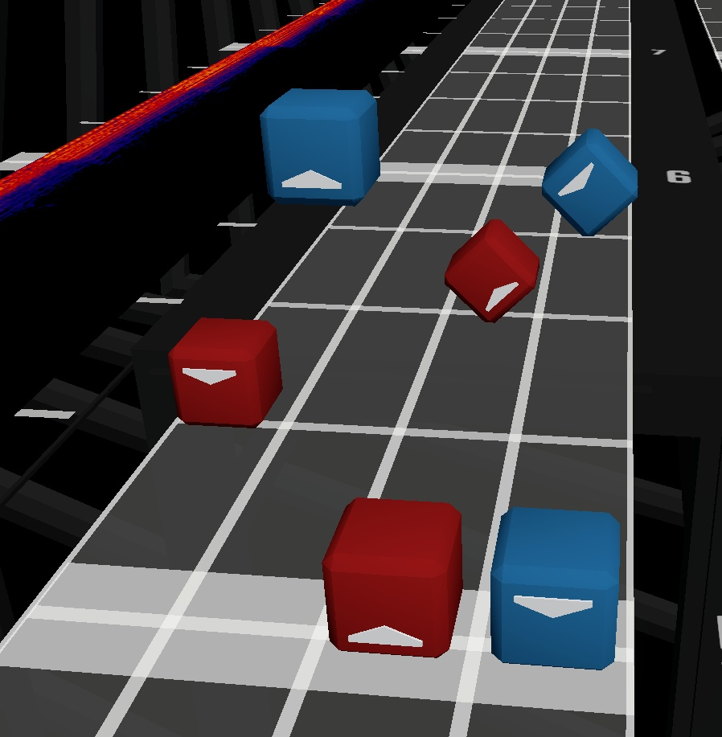 |
| **Cinema** <small>*シネマ*</small> | プレイ中の背景にYouTube等の動画を映すことができるMod。 マッパーが譜面にCinemaの設定を含めることもでき、映す動画・音の同期などを設定しておくことで、プレイヤーは即座に動画を再生できる。設定に自由度があり、スクリーン配置や<a href="#Environment">Environment</a>を改造することも可能。 |
| **しゃがみ壁** <small>*Duck wall, Crouch wall, Squat*</small> | プレイヤーの頭の高さ（上半分）に配置され、実際にしゃがんで避けることを要求される壁。 ＝ダックウォール、クラウチウォール、スクワット |
| **ジャンプ** <small>*Jump*</small> | 同じ色を高速でスイングし続ける配置パターン。スピードを代表する配置であり、高難度配置。 多くは1/3や1/4ビート間隔のような速度を求められるものを指すが、1/2など遅いスイングでもそう呼ばれる場合がある。 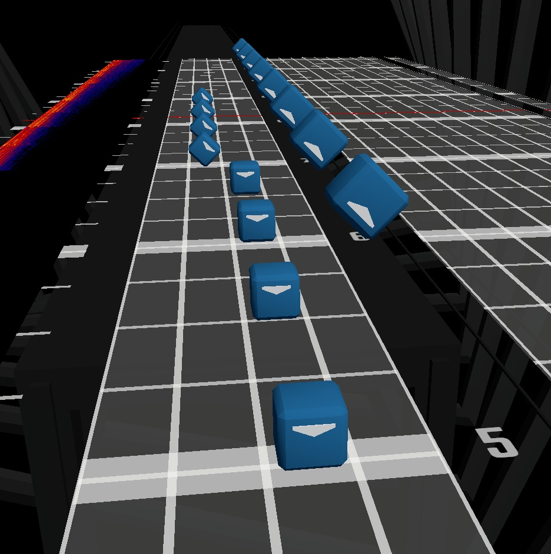 |
| **ジャンプスケア** <small>*Jump Scare*</small> | 予期しない（できない）難しい配置を表す言葉。いわゆる「初見殺し」や「びっくり配置」。 配置の難度が局所的に急上昇していたり、危険・理不尽配置だったり、<a href="#セットアップ">セットアップ</a>が不足していることが原因。 関連: <a href="#diffスパイク">diffスパイク</a> |
| **出張** <small>*Crossover※*</small> | 右手用のノーツを左側に配置するなど、反対側の手で切らせる配置。音ゲー用語。 ※海外ではクロス配置だけでなく出張もCrossoverと呼ばれる |
| **シュラドアングル** <small>*Shrado Angle*</small> | 斜め内向きの切り下げの後、レーンを跨いで真上切り上げが続くパターン。 この形ではきちんとした<a href="#誘導">誘導</a>や<a href="#セットアップ">セットアップ</a>がない限り、プレイヤーは真上ノーツを斜めに切り上げてしまいやすく、<a href="#バッドカット">バッドカット</a>の危険性があるパターンである。 このパターンを<a href="#ランク譜面">ランク譜面</a>で使用したマッパー名（shrado）に由来する。 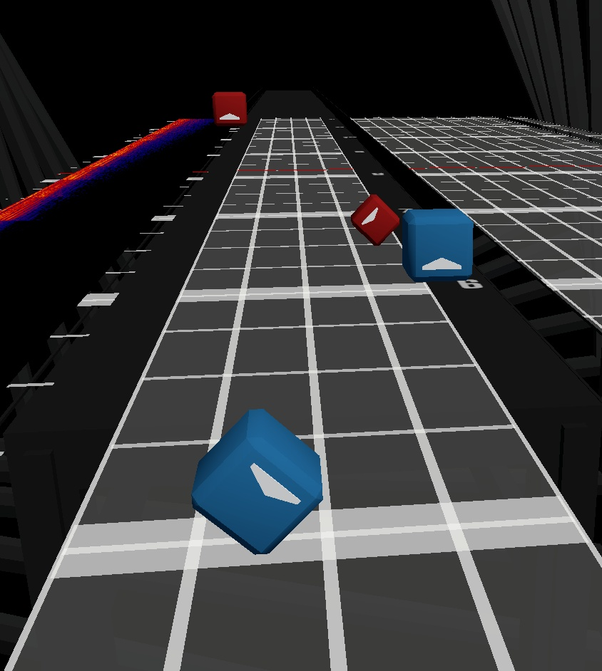 |
| **シングル** <small>*Single*</small> | ノーツが1個のみの配置。方向は問わない。単ノーツ、単発ノーツ。 関連: <a href="#ダブル">ダブル</a> |
| **ScoreSaber** <small>*スコアセイバー*</small> | 世界中のプレイヤーとスコアを競い合うことができる、最も歴史のある非公式リーダーボードMod。およびそのランクシステムを指す。対象となる<a href="#ランク譜面">ランク譜面</a>をクリアすることで<a href="#PP">PP</a>というランクポイントを得られる。 略してSSと書かれることも。 関連: <a href="#BeatLeader">BeatLeader</a> |
| **スタック（動詞）** <small>*Stacked*</small> | ノーツを同じ場所に完全に重なって配置してしまうこと。大抵はコピペミスによって起こる<a href="#ミスマップ">ミスマップ</a>であり、エディター上では判別しにくい為<a href="#テストプレイ">テストプレイ</a>や<a href="#マップチェッカー">マップチェッカー</a>での確認が大事である。 |
| **スタック** <small>*Stack Note*</small> | 同じタイミングで、一直線に2個積み重なったノーツ。シングルノーツよりも強く大きいスイングが求められる。 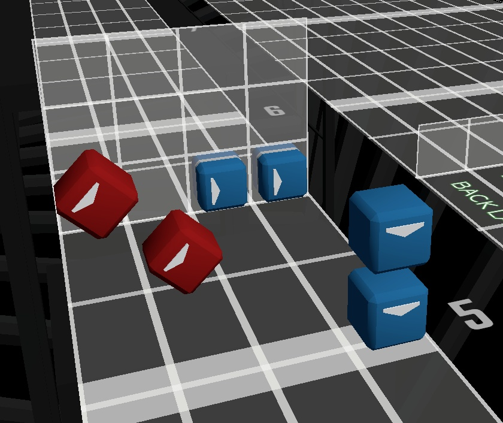 |
| **ステアケース（階段）** <small>*Staircase*</small> | ノーツのスイング軌道上に被る形で、手前または後続に他の色のノーツが配置されているパターン。 ノーツ同士の間隔やBPMによっては、スイング前の軌道またはスイング後の軌道が別の色のノーツと被ってしまい、<a href="#巻き込み">巻き込み</a>（<a href="#バッドカット">バッドカット</a>）の危険性が上がってしまう。 本来の名称は<a href="#ヒットボックス">ヒットボックス</a>・ステアケース（Hitbox Staircase）。 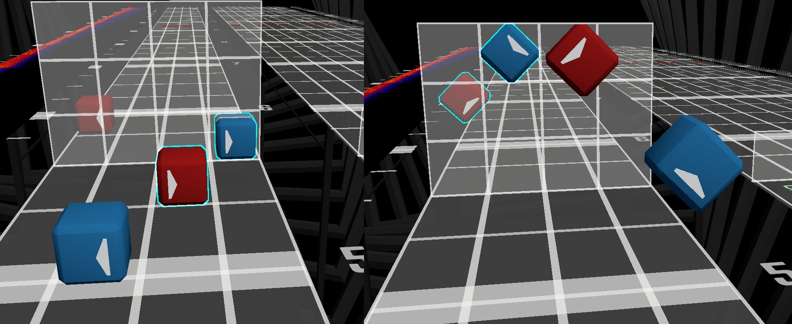 |
| **ストリーム** <small>*Stream*</small> | 左右の色のノーツが交互に、短い間隔で連続して流れてくる一連の配置。長く続く場合、リズムキープとスタミナが求められる。 関連: <a href="#バースト">バースト</a> 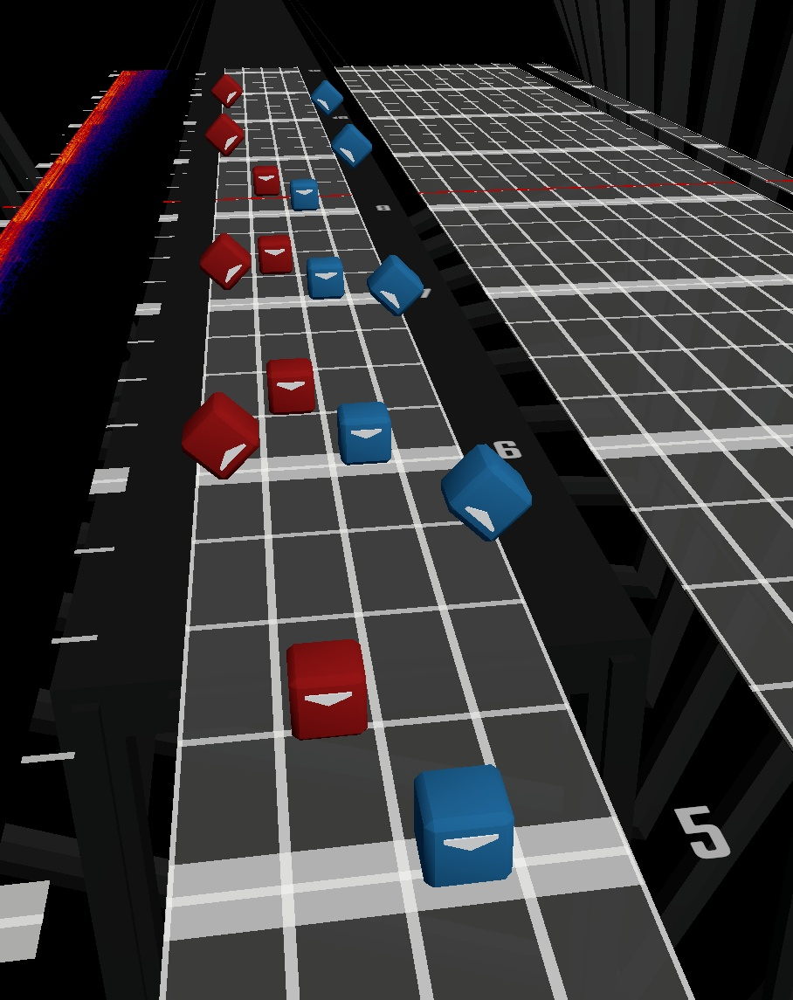 |
| **ストロボ** <small>*Strobe*</small> | ライトを高速で点滅させる激しい演出。 |
| **スピード** <small>*Speed*</small> | セイバーを素早く正確に振り続けることに特化した譜面。<a href="#eBPM">eBPM</a>が高速であり、<a href="#ジャンプ">ジャンプ</a>や<a href="#バースト">バースト</a>などスピードらしい配置がたくさん飛んでくる。 |
| **スピネーション（回外）** <small>*Supination*</small> | ① 前腕を「外側」にひねる動き（手のひらが上を向くような動き）のこと。またはその状態を指す。 ② <a href="#ScoreSaber">ScoreSaber</a>ランク基準では、「手のひらを下にした位置から約180°～210°まで腕を外側に回転させること」と定義されている。 ※「運動」を示す場合は一般的な1の意味で考えてよく、文脈次第では2の基準が用いられる場合もある 関連: <a href="#プロネーション（回内）">プロネーション（回内）</a> |
| **スペクトログラム** <small>*Spectrogram*</small> | 音声の周波数を可視化したグラフのこと。<a href="#ChroMapper">ChroMapper</a>ではレーンの横に表示されており、音が鳴っている箇所を視覚的に特定できる。立ち上がりの速い音ほど境目がクッキリ表示されるので、ドラムやピアノは細い線となって可視化され視認性が高いが、ボーカルは範囲がぼやけがちなので、音によって視認しやすさは異なる。また、音質の悪い音源ほどスペクトログラムの精度は落ちる。 ※画像の曲ではドラムがわずかにスウィング（1/4等間隔ではないハネたリズム）しているのだが、スペクトログラムを見れば正確なタイミングを特定できる 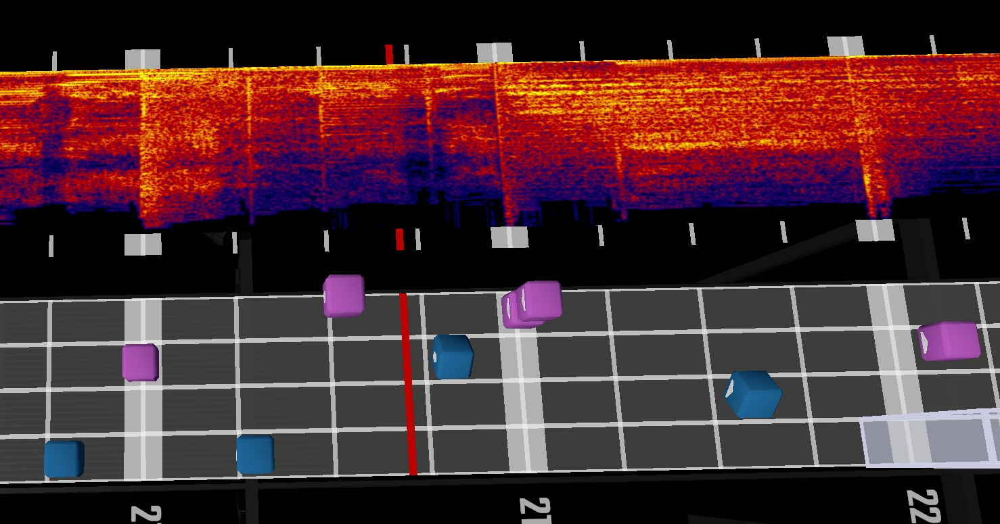 |
| **スポーン** <small>*Spawn*</small> | 奥のスポーン地点からノーツや壁が出現すること。 |
| **スポーン距離** <small>*Spawn Distance*</small> | ノーツが出現する位置からプレイヤーまでの距離。 ＝<a href="#JD">JD</a> |
| **スライダー** <small>*Slider*</small> | 時間をずらしながら複数ノーツを並べて配置し、一振りでなぞるように切らせる配置。先頭を矢印ノーツ、後続をドットにするのが一般的。 ずらす為のビート間隔はBPMや好みにもよるが、1/16、1/24、1/32、1/48あたりがよく使用される。BPMに対して極端に間隔が遅すぎる場合、プレイしづらくなるので注意しよう。Kival<a href="#マップチェッカー">マップチェッカー</a>では間隔が25ミリ秒超過で<a href="#スロースライダー">スロースライダー</a>と判定される。 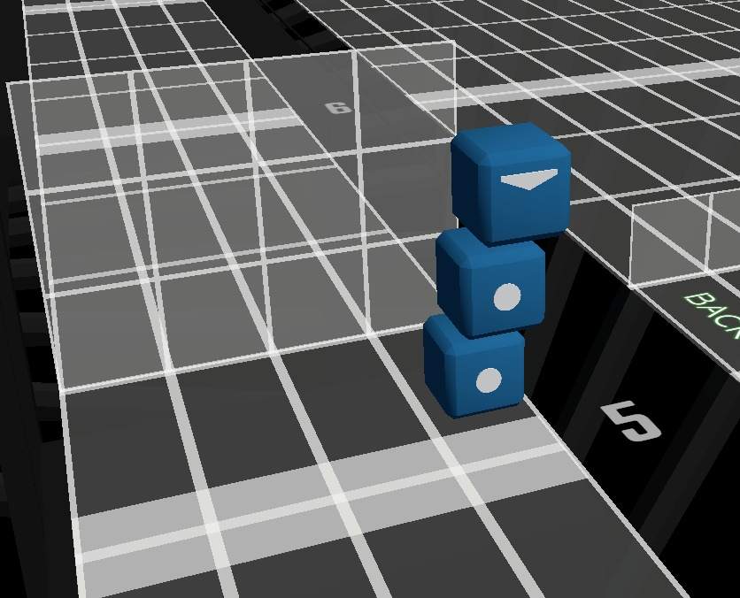 |
| **3-Wide Wall** <small>*スリーワイドウォール*</small> | プレイエリア4レーンのうち、3レーンの幅を覆う壁のこと。プレイヤーは外側レーンまで大きく避けることを余儀なくされ、転倒や家具への衝突の危険性が高い為、よほど特殊な譜面を除きこれを使用してはいけない。4レーン全てを覆う壁は4-Wide Wallであり、さらにNG。 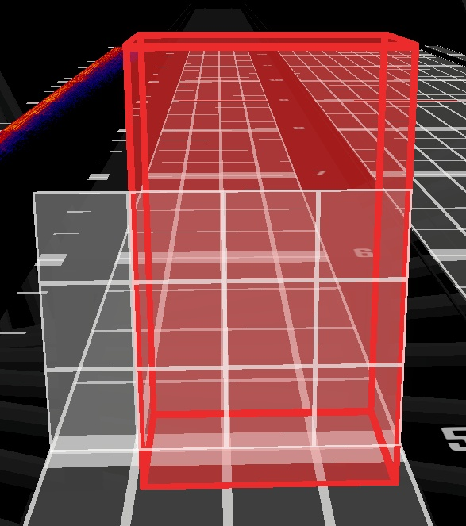 |
| **スロースライダー** <small>*Slow Slider*</small> | 非常に遅い<a href="#スライダー">スライダー</a>。ずらし間隔が通常のスライダーより極端に遅く、ゆっくりなぞって切ることを強制させる配置である。 ずらし間隔に明確な決まりはないが、1/8や1/4がよく見受けられる。その遅さもあって通常のスライダーとは違い、スライダーが長かったり、曲げたり、切り替えしたりといった使い方も多い。特殊な配置であり、角度点を出すことが非常に困難である為、一般的な譜面での使用はおすすめできない（アイデア次第ではあるが）。 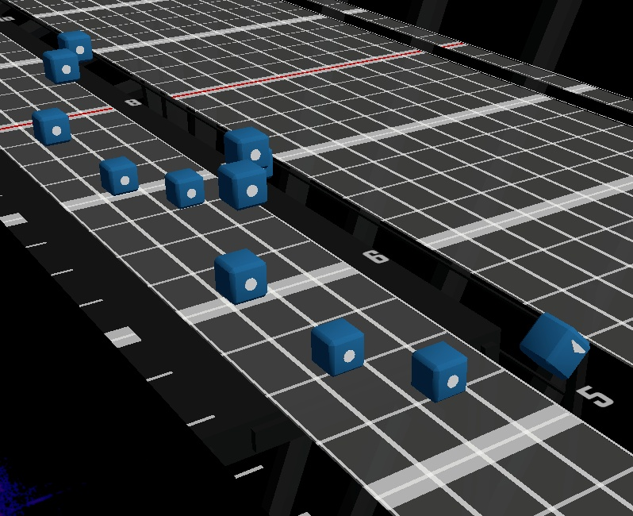 |
| **精度** <small>*Accuracy*</small> | ノーツをどれだけ中心に近い位置で、かつ十分な角度で切れたかを表す言葉。または、合計スコアのパーセンテージの値を指して「精度」と呼ばれる。英語ではAccuracy（アキュラシー）。 関連: <a href="#Acc">Acc</a>(精度譜面) |
| **正当化** <small>*Justification*</small> | マッパーの行った音取りやパターン配置など特定の選択に対し、音楽性や<a href="#一貫性">一貫性</a>、<a href="#セットアップ">セットアップ</a>や<a href="#コンテキスト">コンテキスト</a>などの観点から、その妥当性を示すこと。奇抜なアイデアでも、それが妥当である理由がきちんと譜面にある（伝わる）ならば、それは正当化できると言える。 主に譜面のレビューや、ランク化の為のModdingで用いられる言葉であり、言葉通りの意味である。 |
| **精密回転** <small>*Precision Rotation*</small> | ノーツの角度を1度単位で細かく変更すること。角度<a href="#オフセット">オフセット</a>ともいう。 元々は<a href="#MappingExtensions">MappingExtensions</a>や<a href="#NoodleExtensions">NoodleExtensions</a>でのみ使用できたが、<a href="#V3マップ">V3マップ</a>以降では公式で対応した。 ※壁の精密回転はMod必須 |
| **精密配置** <small>*Precision Placement*</small> | ノーツや壁を、4x3マスグリッドの規格を超えて、ミリ単位レベルで自由に配置すること。 <a href="#NoodleExtensions">NoodleExtensions</a>（または<a href="#MappingExtensions">MappingExtensions</a>）が必須。 |
| **Settings Setter** <small>*セッティングセッター*</small> | 譜面を遊ぶ際、マッパーが推奨するゲーム内設定（ライティングをオンにする、HUDを消す等）をプレイヤーへ自動的に提案してくれる機能。プレイボタンを押した時に専用の確認画面が表示される。 <a href="#Heck">Heck</a>により機能する。譜面に設定する場合は<a href="#ChroMapper">ChroMapper</a>プラグインのPropEditを使うのが簡単でオススメ。 |
| **セットアップ** <small>*Setup*</small> | 次のパターンを無理なく切れるように、直前までの配置を工夫してプレイヤーの腕や身体を適切に準備させること。 ※「<a href="#誘導">誘導</a>」とほぼ同義であり使用ケースもほぼ被っているが、こちらは次の動作を成立させるための物理的・構造的な「準備」のニュアンスが強い。例えば「巻き込みが怖い配置だから、直前のノーツを適切な場所に置いてスイング軌道が被らないようにする」など。 |
| **SongCore** <small>*ソングコア*</small> | ゲーム内にカスタム譜面を読み込んで遊べるようにするための必須Mod。 ※カスタム譜面自体は<a href="#バニラ">バニラ</a>でも遊べるが、それをより使いやすく遊びやすくする為のもの |

## タ行

| 用語 | 意味 |
| --- | --- |
| **Diamonds in the Rough (DITR)** <small>*ダイアモンドインザラフ*</small> | 新人マッパーが経験豊富なコーチとペアになり、<a href="#キュレート">キュレーション</a>に値するマップを作り上げるイベント。<a href="#Beat Saber Mapping">Beat Saber Mapping</a>サーバーで毎年主催されている。「ダイヤの原石」の意味。 毎年、新人マッパーたちが長い時間を費やしてクオリティの高い作品を完成させている。 プレイリストやイベント詳細は<a href="https://bsaber.com/posts/diamonds-in-the-rough" target="_blank">こちらから</a> |
| **ダブル** <small>*Double*</small> | 赤青同時に切るノーツ配置。方向は問わない。同時切り、同時ノーツ。 関連: <a href="#シングル">シングル</a> |
| **タワー** <small>*Tower*</small> | 同じタイミングで、一直線に3個以上積み重なったノーツ。スイングの勢いが特に要求される為、<a href="#スタック">スタック</a>や<a href="#スライダー">スライダー</a>よりも強い配置である。 横に4個使うタワーは4wideタワーとも呼ぶ。 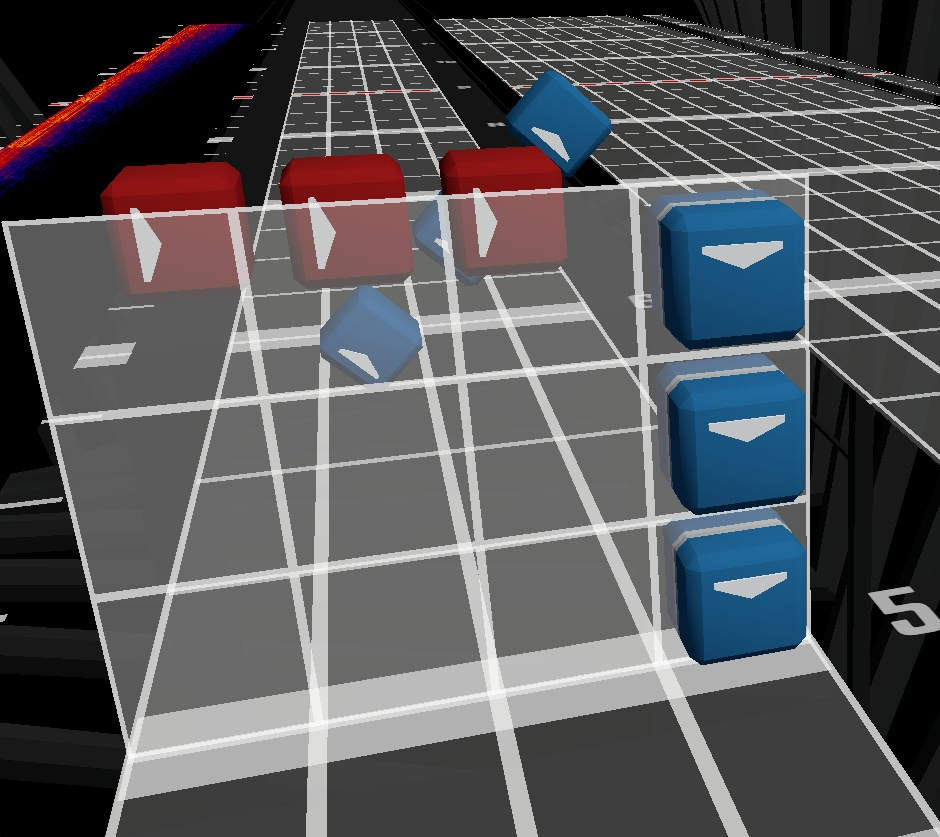 |
| **ダンス** <small>*Dance*</small> | 大きな腕の振りや体の動きを使い、ほどほどの低密度で、曲に合わせて踊っているかのような譜面。多くの人が楽しめるジャンルといえる。 |
| **チェイン** <small>*Chain*</small> | 細いブロックが複数連なるノーツ。軌道に合わせてなぞるように切る。 先頭の矢印ブロックをチェインヘッド、後ろに連なる細いブロックはチェインリンクと呼ぶ。主に長い音や、細かい連続音を<a href="#表現">表現</a>するために使用される。通常のノーツとスコアリングが異なる <a href="https://note.com/toro_desu/n/na6238f3f26c7" target="_blank">解説記事</a> 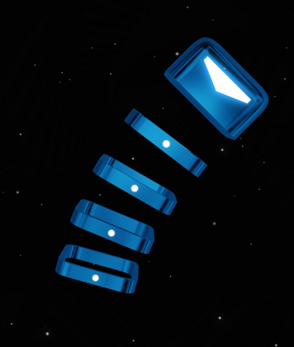 |
| **チャレンジ** <small>*Challenge*</small> | スコアよりも、クリアすること自体が目的の超高難易度譜面。セオリーやルールを逸脱した配置、極端な速度、人間離れした配置などなど、攻略を探求しながら限界に挑むために遊ぶ。 チャレンジ譜面を専門に扱うコミュニティが存在し、専用のプレイリストとランキングシステムもある。→「Beat Saber Challenge Community（BSCC）」、「Challange Saber」 中には、クリア難易度を落とした初級者向けのチャレンジ譜面(?)も存在する。 <a href="https://youtu.be/XXqvBboLLuk" target="_blank">参考動画 (Cube Community)</a> |
| **DMCA** <small>*ディーエムシーエー*</small> | デジタルミレニアム著作権法。著作物の無断使用を権利者が差し止める為の制度。 |
| **DD** <small>*ディーディー, Double Directional*</small> | 同じ色を同じ方向に連続で切らせる配置。自然な腕の交互の振り（<a href="#パリティ">パリティ</a>）を阻害するため、低難易度や特殊な譜面を除いては基本的に避けるべき配置である。ダブルディレクションの略。 ※<a href="#ボムリセット">ボムリセット</a>は直感的な<a href="#リセット">リセット</a>が行える為、DDには含まれない。 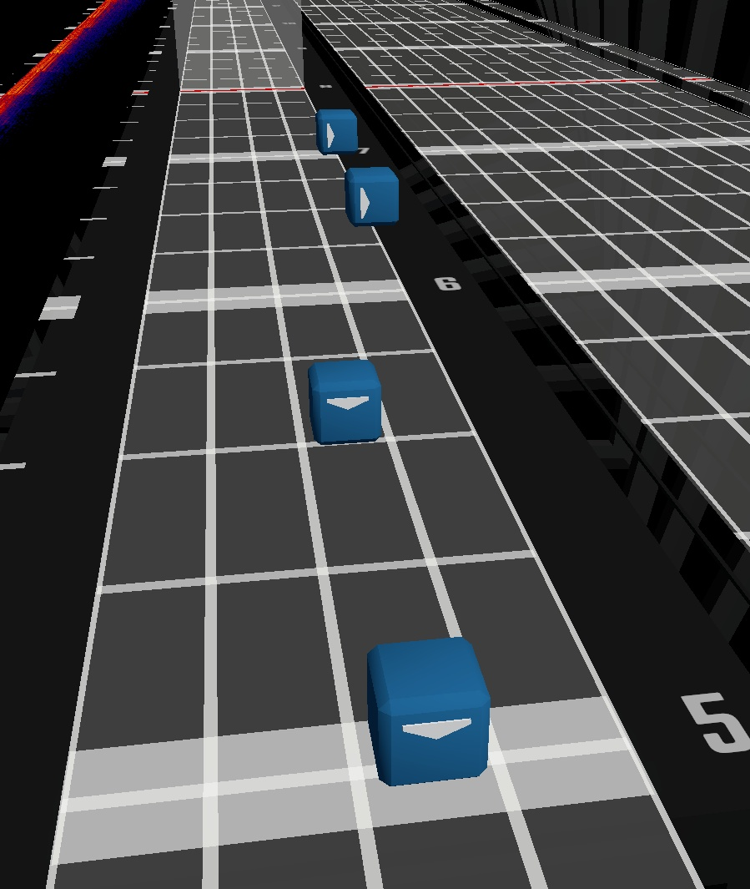 |
| **diffスパイク** <small>*diff spike*</small> | 譜面を通しで見た時、特定の配置またはパートで、難易度が急上昇していること。 関連: <a href="#ジャンプスケア">ジャンプスケア</a> |
| **テストプレイ** <small>*Playtest*</small> | マッピング中の<a href="#WIP">WIP</a>譜面を実際にプレイし、問題や違和感がないか確認すること。自身でテストするか、誰かに頼む場合もある。 Discord等で他人の譜面を受け取ってテストプレイをする際は、必ずwipフォルダ「CustomWIPLevels」に入れてプレイしよう（CustomLevelsにwip譜面を入れてプレイするとリーダーボードが作成されてしまう）。 また、<a href="#BeatSaver">BeatSaver</a>にテスト目的などでwip譜面を公開することは禁じられているので注意しよう。 関連: <a href="#wipbot">wipbot</a> |
| **テック** <small>*Tech*</small> | 角度変化が多かったり、複雑な切り方を要求する譜面ジャンル。 手首、腕、肩などの可動域を積極的に使い、「どう切るか」という技術的な読み・アプローチの難しさに特化している。 |
| **ドッジウォール** <small>*Dodge Wall*</small> | 中央2レーンどちらかを覆う、プレイヤーに左右への回避動作を促すために配置される壁。＝<a href="#壁よけ">壁よけ</a> ※中央2レーン完全に覆う壁は安全にプレイできない為、使用してはいけない。 関連: <a href="#3-Wide Wall">3-Wide Wall</a> |
| **ドットノーツ** <small>*Dot Note*</small> | 切る方向が指定されていない、中央に丸い点が描かれたノーツ。どの方向から切ってもよい。 |
| **トライアングル** <small>*Triangle*</small> | 片手で、三角形の頂点を辿るように3つのノーツを切らせる配置パターン。 「<a href="#パリティ">パリティ</a>が崩れ、<a href="#リセット">リセット</a>が発生してしまうこと」がこの配置の本質であり、<a href="#DD">DD</a>と同様、基本的には推奨されない。※高難度テック譜面等でパリティが適切に保たれる場合はトライアングルとはならない。 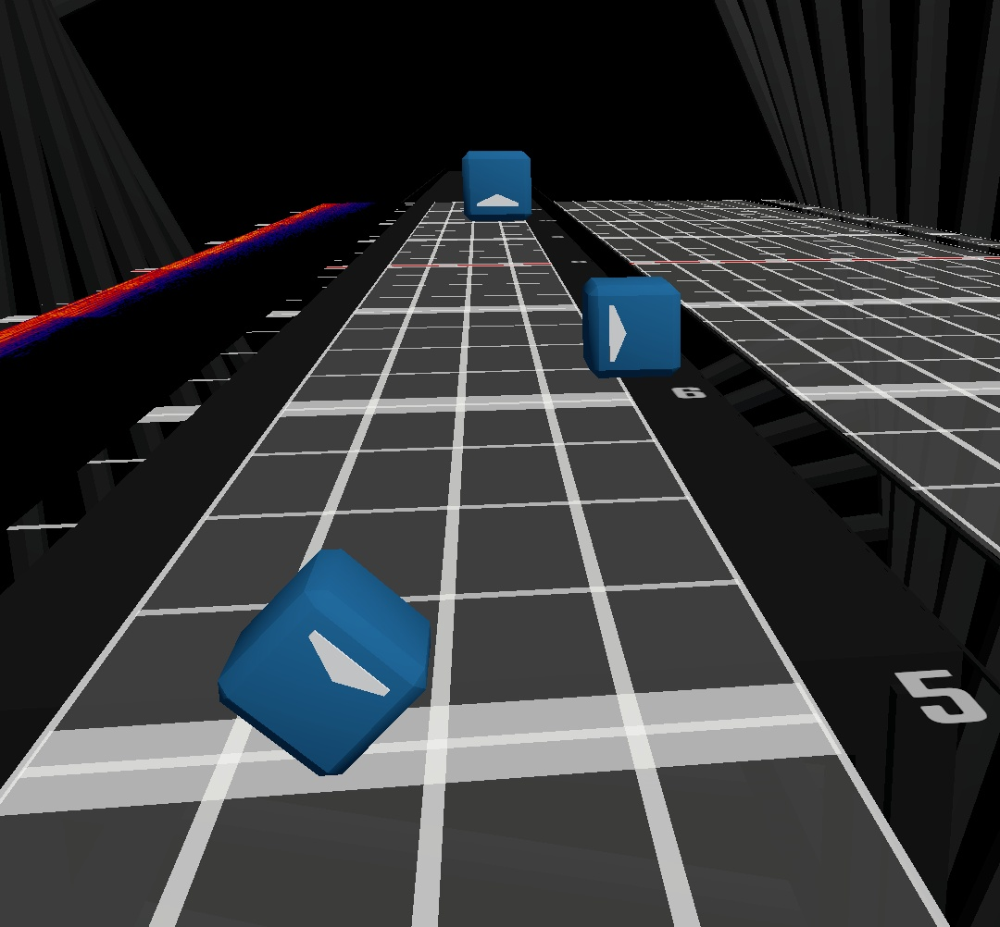 |
| **Track** <small>*トラック*</small> | <a href="#Chroma">Chroma</a>, <a href="#NoodleExtensions">NoodleExtensions</a>, <a href="#Vivify">Vivify</a>において、単一または複数のオブジェクト（ノーツ、ライト、<a href="#Environment">Environment</a>造形物など）に名前を付け、管理・制御するための機能。Track名をつけたオブジェクトは好きなタイミングで動かしたり消したり大きくしたりといったアニメーション指示が可能になる。 |
| **トランジション** <small>*Transition*</small> | ① ライティングにおける「ライトから別のライトに遷移」する為のライトイベント。明るさを100→0に滑らかに遷移させたり、赤→青といった色の遷移も可能。 ② ノーツからノーツへ動きが遷移する際の「繋がり」を指す（ほぼ海外でのみ使われる言葉）。「ここの配置のトランジションがスムーズじゃない」等々。 |

## ナ行

| 用語 | 意味 |
| --- | --- |
| **難易度** <small>*Difficulty*</small> | 標準的な難易度単位を指した言葉。EasyからExpertPlusまでの5段階がある。英語ではDifficulty。略してdiff。 Standard区分で5難易度揃っていることを<a href="#フルスプレッド">フルスプレッド</a>と呼ぶ。 |
| **NoodleExtensions** <small>*ヌードルエクステンション*</small> | <a href="#MappingExtensions">MappingExtensions</a>をさらに発展させ、ノーツの軌道アニメーションを曲げたりノーツの大きさを変えたりプレイヤーを動かしたりなどなど、ゲームプレイそのものを変えてしまうような高度なマッピング拡張Mod。そのような特殊な譜面は<a href="#Modchart">Modchart</a>と呼ばれる。 略してNEと書かれることも。 |
| **No Arrows** <small>*ノーアローズ*</small> | 全てのノーツを「ドットノーツ」で配置した難易度の為の<a href="#ゲームモード">ゲームモード</a>。 自由な切り方で楽しめるほか、いわゆる「ダースモール」等の特殊なプレイスタイルでも遊びやすい。 似たものとして、全てのノーツをドットノーツに「変更して」プレイできる同名のモディファイアも存在するが、こちらはあらゆる譜面でNo Arrowsがプレイできるものの、スコアにマイナス補正がつくほか、アークが消える。 |
| **ノーツ** <small>*Note*</small> | プレイヤーがセイバーで切る対象となるブロック。切る方向が矢印で指定されているものと、指定がないもの（ドット）がある。 |

## ハ行

| 用語 | 意味 |
| --- | --- |
| **バースト** <small>*Burst*</small> | ドラム音などが急激に高速になる箇所。および、その音を拾った高速<a href="#ストリーム">ストリーム</a>のこと。 通常、1/6間隔または1/8間隔で置かれるストリームを指す。エレクトロニック楽曲のサビ前（ビルドアップ）でよく出てきがち。 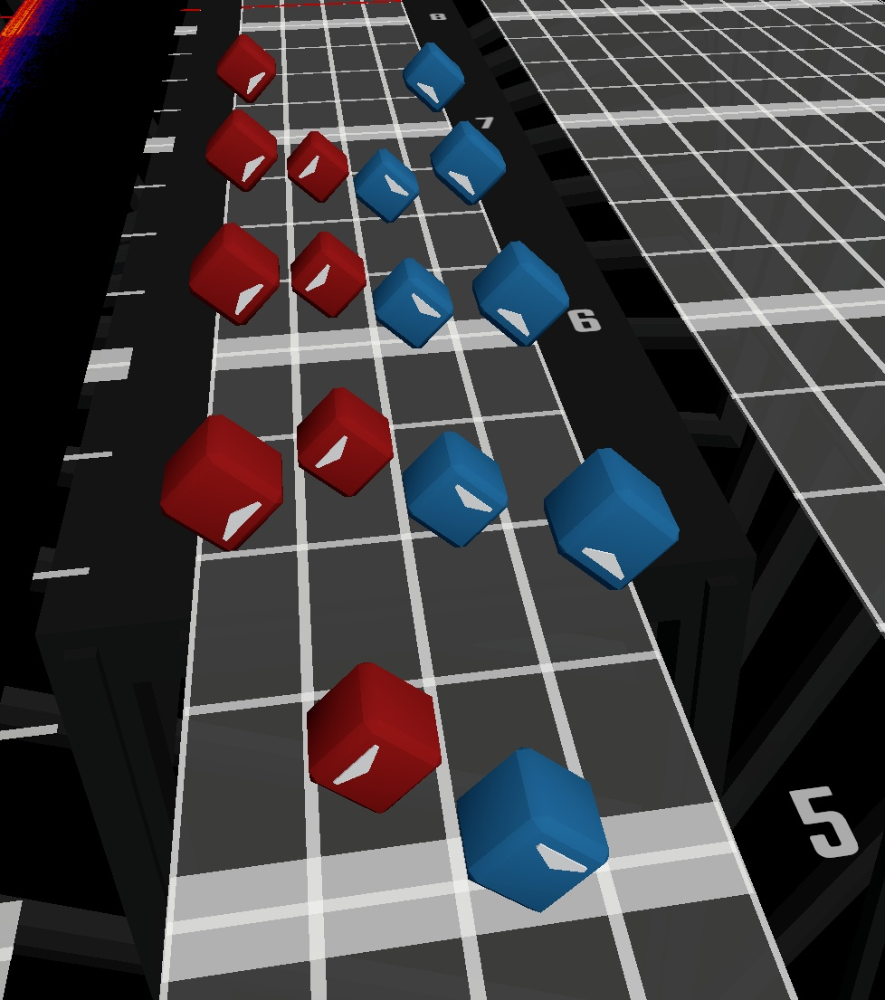 |
| **パームアウト** <small>*Palm out*</small> | 手のひらが外側を向いている状態。または、その状態で切らせる配置。テック譜面でよく使用される。 |
| **パームアップ** <small>*Palm up*</small> | 手のひらが上側を向いている状態。または、その状態で切らせる配置。テック譜面でよく使用される。 |
| **ハイテック** <small>*High Tech*</small> | 強烈な角度や手首の急激な切り返しが連続するような、極めて高難度なテック譜面。また、譜面自体の難易度が高く、密度多めで物量やスピード要素が混じってくることも多い。高い認識力と巧みなセイバー捌きが強く要求される。 |
| **ハイパーウォール** <small>*Hyper Wall*</small> | 壁の持続時間（奥行き）を負の値にした壁。通常の壁よりも高速で流れる。 ゲームの想定されてない挙動である為、基本的には推奨されない。 |
| **バイブロ** <small>*Vibro*</small> | 手を小刻みに震わせることでしか処理できないような、超高速の上下配置。およびその譜面。 れっきとした<a href="#チャレンジ">チャレンジ</a>配置であり、<a href="#インライン">インライン</a>や<a href="#パラレルノーツ">パラレルノーツ</a>で置かれることも多く、ほとんどが<a href="#オーバーマッピング">オーバーマッピング</a>で行われる。チャレンジ譜面の中での代表的ジャンルといえる。 <a href="https://youtu.be/3SfQ92q-0bU&t=162" target="_blank">参考動画 (Cube Community)</a> |
| **拍** <small>*Beat*</small> | 音楽における、ベースとなる規則的な間隔で刻まれるリズムの単位。拍子は拍のまとまり。 ＝ビート |
| **パターン** <small>*Pattern*</small> | 単一の、または一連のノーツ配置の型や組み合わせ。 |
| **Pack** <small>*パック*</small> | 特定アーティストや音楽ジャンル等、テーマに沿って作られた譜面をまとめたもの。いわばプレイリストではあるが、これは「Packの為に作った専用譜面をまとめたもの」を指す。 カスタム譜面では自分で（または人を誘い）譜面を作りさえすれば自由にPackを名乗れる（名称は自由）。 <a href="#BeastSaber">BeastSaber</a>では、審査によって認定されたPackを「Featured Pack」としてピックアップしてくれる仕組みがある（<a href="#BeatSaver">BeatSaver</a>ではそのプレイリストが<a href="#キュレート">キュレート</a>される）。より多くの人に遊んでもらいやすくなるので、Packを作る際は是非利用しよう。Featured Packの条件は<a href="https://bsaber.com/posts/getting-started-with-featured-packs" target="_blank">こちら</a>から。 |
| **バックスラッシュ** <small>*Backslash*</small> | セイバー（腕）を背中に回して、背中越しに切らせる配置。またはその行為そのもの。 ただし、ノーツ配置だけで「背中越しに切らせる意図」をプレイヤーに示すことは困難なので、譜面説明や難易度ラベル等で明示的にしつつ、譜面の中で「ドットノーツはバックスラッシュ用のノーツ」というルールで統一してわかりやすくしている譜面が多い。<a href="#ギミック">ギミック</a>の一種と言える。 <a href="https://x.com/okyou029/status/1791587863206990080" target="_blank">参考動画（X）</a> |
| **バックハンド** <small>*Backhand*</small> | 手の甲側に振り抜くスイング。 関連: <a href="#フォアハンド">フォアハンド</a> |
| **バッドカット** <small>*Bad cut*</small> | 矢印と違う方向から斬ったり、違う色のセイバーで斬ったりすること。ミス判定となりコンボが途切れる。 関連: <a href="#巻き込み">巻き込み</a> |
| **バニラ** <small>*Vanilla*</small> | Modを一切導入していない素のゲームの状態を指す。ゲーム用語。 譜面において、<a href="#Chroma">Chroma</a>等のModを使用していないライティングはバニラライティングとも呼ばれる。 バニラフレーバー＝定番・プレーンという連想から |
| **パブリッシュ** <small>*Publish*</small> | 完成した譜面を<a href="#BeatSaver">BeatSaver</a>に公開し、他のプレイヤーが遊べる状態にすること。 関連: <a href="#リパブリッシュ">リパブリッシュ</a> |
| **パラレルノーツ** <small>*Parallel Note*</small> | 同じ色・同じ方向のノーツが、横に2つ以上並んでいる配置。通常のスイングでは取りこぼしてしまう為、<a href="#ヒットボックス">ヒットボックス</a>や方向判定の仕組みを利用（悪用）した切り方が求められる。特殊な配置。ロロッペノーツとも。 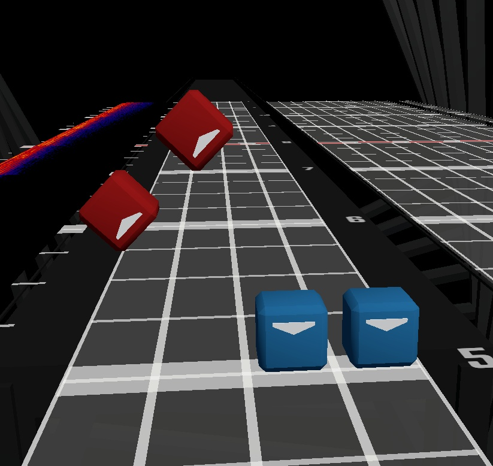 |
| **Balanced** <small>*バランス、バランスド*</small> | 特定のマップスタイルに偏りすぎていない、または、様々なスタイルをバランスよく用いた譜面。そのジャンル。 |
| **パリティ** <small>*Parity*</small> | セイバーの自然な振りの為、フォアハンドスイングとバックハンドスイングが交互に続くようノーツを配置するという概念。パリティが保たれている譜面は直感的でプレイしやすく、現代マッピングのセオリーとなっている。 <a href="https://note.com/toro_desu/n/n6cad8770caaf" target="_blank">解説記事</a> |
| **ハンドクラップ** <small>*Handclap*</small> | 赤青が向かい合ったノーツ配置。コントローラーが衝突する危険性が高い為、基本的に推奨されない。 ※<a href="#クラッシュ">クラッシュ</a>すること自体を指してハンドクラップと呼ぶ場合もある 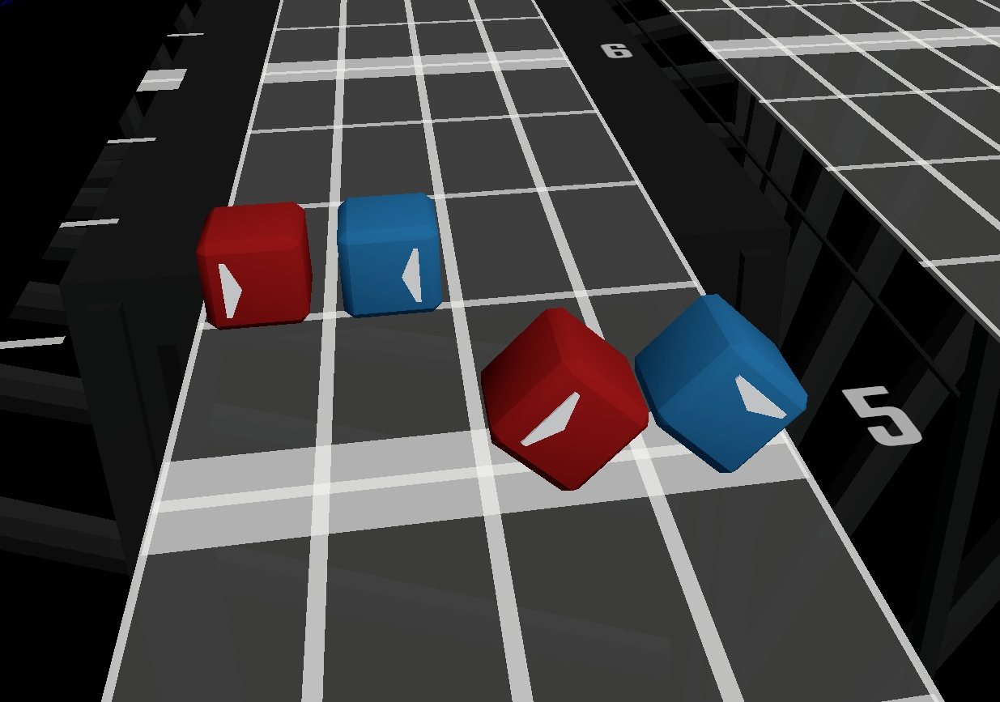 |
| **ハンマーヒット** <small>*Hammer Hit*</small> | 矢印の先にボムが配置されているノーツ。これを切るためにはノーツカットの瞬間にセイバーを止める必要があり、角度点をとるのが困難になる為、推奨されない。 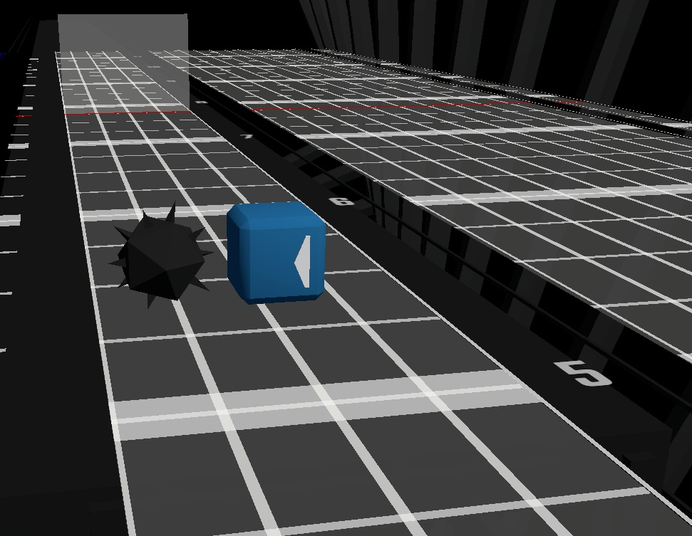 |
| **bsr** <small>*ビーエスアール*</small> | <a href="#BeatSaver">BeatSaver</a>に譜面をアップロードした際に割り当てられる、16進数の短い英数字（例: 4f6a4）のこと。譜面ID。bsrキー、bsr番号とも。 Beat Saber Requestの略であり、Twitch配信などで視聴者がリクエストを送る際の!bsrコマンドが元々の言葉であるが、譜面IDそのものを指してbsrとも呼ばれる。BeatSaverの譜面にある「！」ボタンをクリックするとリクエスト用のコマンドとIDがコピーされる。 |
| **BSMG** <small>*ビーエスエムジー*</small> | Beat Saber Modding Groupの略。世界最大の非公式Beat Saberコミュニティ、およびそのdiscordサーバー。 Mod導入・開発や譜面制作、モデル制作、ゲームのQ&A、イベント開催などなど、Beat Saberにまつわるあらゆるトピックが扱われる。WebサイトのWikiはマッパー・プレイヤー問わず必見。 <a href="https://bsmg.wiki/" target="_blank">https://bsmg.wiki/</a> |
| **BSManager** <small>*ビーエスマネージャー*</small> | Beat Saberの複数バージョンの共存や、Mod、マップ、プレイリストのインストールなどを一括管理できる強力なオールインワンツール。<a href="#BSMG">BSMG</a>コミュニティではBSManagerの導入が推奨されている。 |
| **BeastSaber** <small>*ビーストセイバー*</small> | <a href="#BeatSaver">BeatSaver</a>と連携し、おすすめ譜面（<a href="#キュレート">キュレート</a>）や<a href="#Map of the Week">Map of the Week</a>、おすすめプレイリストの紹介、情報記事の公開、<a href="#マッピングアワード">マッピングアワード</a>の企画などなどを行うポータルサイト。 ※キュレート譜面、キュレートプレイリストはBeatSaverでも確認できる <a href="https://bsaber.com/" target="_blank">https://bsaber.com/</a> |
| **ビート** <small>*Beat*</small> | 拍のこと。 マッピングにおいて特定の配置等に言及する際、「34.5ビートの配置が～」というようにビート数で示されることが多い。 |
| **BeatSaver** <small>*ビートセイヴァー、ビートサーバー*</small> | ユーザーが作成したカスタム譜面をアップロード・ダウンロードできる非公式サイト。 ※発音はビートセイヴァーが正しいのだが、日本語発音だとビートセイバーと区別がつきにくいので、わかりやすく「ビートサーバー」と言い換える人も多い |
| **Beat Saber Mapping** <small>*ビートセイバーマッピング*</small> | マッピングとライティングに関する情報に特化したDiscordサーバー。初心者からベテランまで誰でも。 <a href="#BSMG">BSMG</a>と同様、マッパーはとりあえず参加しておこう。 略してBSM。 |
| **BeatLeader** <small>*ビートリーダー*</small> | <a href="#ScoreSaber">ScoreSaber</a>の後に登場した非公式リーダーボードMod。およびそのランクシステム。Webからも確認できるリプレイ機能や詳細な統計データの分析など、<a href="#ランク譜面">ランク譜面</a>をプレイしない人にも便利な多機能さが特徴。独自のセイバーMod「ReeSabers」も提供している。 略してBLと書かれることも。 |
| **PP** <small>*ピーピー*</small> | <a href="#ScoreSaber">ScoreSaber</a>や<a href="#BeatLeader">BeatLeader</a>で、<a href="#ランク譜面">ランク譜面</a>をクリアした際に実力に応じて得られるパフォーマンスポイント。各ランクではこれを稼ぐことで競い合っている。 |
| **BPM** <small>*ビーピーエム*</small> | 1分間あたりの拍数（テンポ）。曲の速さを示す音楽的な指標。 Beats Per Minuteの略。 |
| **ビジョンブロック** <small>*Vision Block*</small> | 中央2マスいずれかに位置するノーツ・ボム・壁が視界の邪魔になり、次に切るべきノーツが隠れて見えなくなること。プレイが困難になる為、基本的にはそれが起きないようマッピングすべきである。略してVB。 <a href="#HJDライン">HJDライン</a>を活用することで、ビジョンブロックを回避しながらマッピングすることが容易になる。 |
| **ヒットボックス** <small>*Hitbox*</small> | ノーツに設定されている「当たり判定」の領域。見た目のサイズより大きめに設定されている。 画像の赤枠がヒットボックス。紫枠は<a href="#バッドカット">バッドカット</a>判定が発生する領域。 ※画像は<a href="#BeatLeader">BeatLeader</a>から 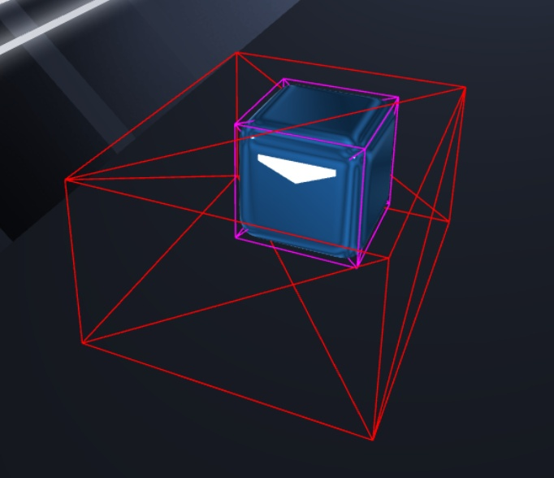 |
| **表現** <small>*Representation*</small> | 曲の音、リズム、ボーカルなどを、ノーツの配置やライティング等で解釈し譜面として落とし込み、具体化・抽象化して表すこと。譜面の評価基準のひとつ。 |
| **VNJS** <small>*ブイエヌジェーエス*</small> | ノーツの流れてくる速度（<a href="#NJS">NJS</a>）が曲の途中で変化する機能。1.40.0で追加された公式要素で、<a href="#V4マップ">V4マップ</a>で利用できる。 パートの変化に合わせてNJSを変えられるだけでなく、使い方の工夫により、ノーツを消したり止めたり巻き戻したりといった<a href="#ギミック">ギミック</a>効果を作り出すことも可能。Variable NJSの略。可変NJS、ソフラン（音ゲー用語）とも。 <a href="https://x.com/ge2toro/status/1877682614338769133?s=20" target="_blank">参考動画</a> |
| **V3ウォール** <small>*ブイスリーウォール*</small> | <a href="#V3マップ">V3マップ</a>以降で使用できる、位置・高さを細かく調整できるようになった壁。横方向はレーン外に設置することも可能。 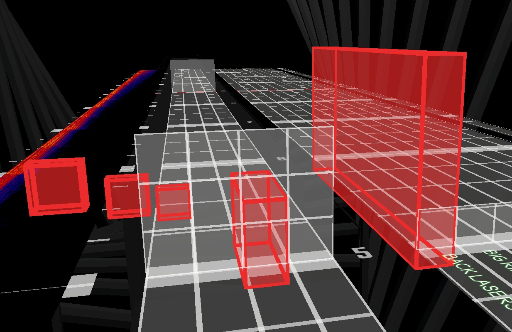 |
| **V3マップ** <small>*ブイスリーマップ*</small> | 譜面形式のバージョン、V3フォーマットで作られたマップを指す。 チェイン、アーク、<a href="#V3ライティング">V3ライティング</a>、<a href="#V3ウォール">V3ウォール</a>などが新要素として追加された。 関連: <a href="#マップフォーマット">マップフォーマット</a> |
| **V3ライティング** <small>*ブイスリーライティング*</small> | <a href="#V3マップ">V3マップ</a>で導入された新しいライティングシステム。詳細なライト制御、オブジェクトを自由にアニメーションさせたりなど、ライティング<a href="#表現">表現</a>の自由度が格段に増した。 Weave <a href="#Environment">Environment</a>以降がV3ライティングシステムである。V3以降のマップ形式でのみ利用可能。 |
| **V2マップ** <small>*ブイツーマップ*</small> | V3が導入される前の譜面フォーマット。アークやチェインなどは使えない。 関連: <a href="#マップフォーマット">マップフォーマット</a> |
| **V2ライティング** <small>*ブイツーライティング*</small> | <a href="#V2マップ">V2マップ</a>時代から存在するシンプルなライティングシステム。5～9種のライトを点灯でき、リングやレーザーなどの簡単な制御が行える。<a href="#Chroma">Chroma</a>を導入することで詳細な制御・改造が可能。 Gaga <a href="#Environment">Environment</a>までがV2ライティングシステムである。V3以降のマップ形式でも利用可能。 |
| **Fitbeat** <small>*フィットビート*</small> | しゃがみ壁や左右への壁よけ、動きのあるノーツ配置を使い、曲にノリながら全身を使った運動（フィットネス）に特化したジャンル。全身運動の相性の良さからテック配置が使われることも多い。公式譜面の"Fitbeat"が由来。 純粋にスクワットだけを繰り返す譜面はスクワット譜面として区別される。 |
| **V4ウォール** <small>*ブイフォーウォール*</small> | <a href="#V4マップ">V4マップ</a>では、壁の縦方向の設置可能範囲がさらに広がっており、それを利用した壁のこと。 技術的に言うと、壁の垂直位置 y=3,4 が利用可能になった。 ※1.41以降のゲームでのみ機能する 関連: <a href="#V3ウォール">V3ウォール</a> 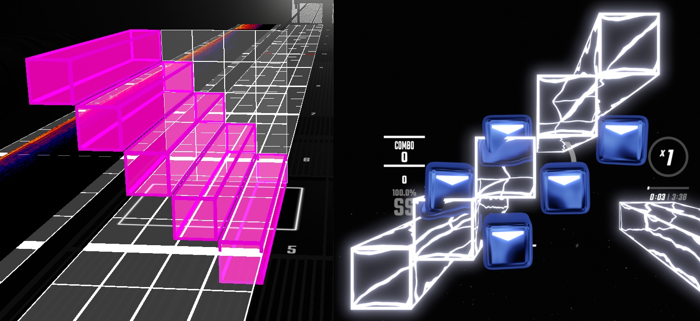 |
| **V4マップ** <small>*ブイフォーマップ*</small> | 譜面形式のバージョン、V4フォーマットで作られたマップを指す。 譜面データ構造を刷新して効率化された。ゲームver1.34.5以降でのみプレー可能。 <a href="#VNJS">VNJS</a>、<a href="#V4ウォール">V4ウォール</a>という新要素もあるが、それぞれ特定バージョン以降でしか機能しない点に注意。 関連: <a href="#マップフォーマット">マップフォーマット</a> |
| **V1** <small>*ブイワン*</small> | ① アーリーアクセス時代の<a href="#マップフォーマット">マップフォーマット</a>。現在では廃止されV2以降がサポートされている。 ② Beat Saber初期の頃の配置スタイルを指す。<a href="#パリティ">パリティ</a>の概念が無かったり、ノーツが下段中段に集中していたり、配置が自由奔放だったりが特徴。いにしえの譜面。 |
| **ブーストライト** <small>*Boost Light*</small> | <a href="#バニラ">バニラ</a>ライティングにおける、メイン2色＋ホワイト1色の3色のカラーセットとは別の、追加のカラーセット（ブーストカラー）のライト。 ブーストイベントを配置することで、その瞬間にライトの色はブーストカラーのセットへと切り替わり、曲展開に合わせて異なるカラーセットを使い分けることができる。異なるカラーセットの同時使用はできない。 一部の古いV2 <a href="#Environment">Environment</a>では、デフォルトではブーストカラーが存在しないものがあり、その場合使用する為には<a href="#カスタムカラー">カスタムカラー</a>の設定が必要である。 |
| **プードル** <small>*Poodle*</small> | 同じ向きのノーツが大量に連なっている配置。およびその譜面。 プレイヤーは軌道に合わせてセイバーをなぞるようにゆっくりスイングすることで、一振りで切ることができる。Beat Saberにおけるホールドノーツ。 切り方に少しコツはいるが、難易度の低いプードル譜面であれば直感的にプレイしやすく、現在では<a href="#BeatSaver">BeatSaver</a>で譜面タグがあるほどの1ジャンルになっている。  元々は<a href="#ポール">ポール</a>ノーツが元祖であり、ポールに<a href="#NoodleExtensions">NoodleExtensions</a>を用いることで軌道を滑らかに曲げ、より切りやすくしたものがプードルである。Paul + Noodle = Poodle 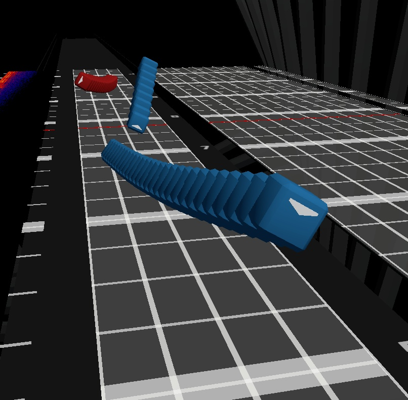 |
| **フェイクウォール** <small>*Fake Wall*</small> | <a href="#NoodleExtensions">NoodleExtensions</a>を利用し、触れてもダメージを受けない演出用の壁。 <a href="#バニラ">バニラ</a>でも壁の幅を負の値にすることで同様の壁を置くことができるが、本来想定されていない動作である為あまり推奨されない。 |
| **フェイクノーツ** <small>*Fake Note*</small> | <a href="#NoodleExtensions">NoodleExtensions</a>を利用し、実際には切れない（判定がない）視覚的な演出として配置されるノーツ。 |
| **フェイスノーツ** <small>*Face Note*</small> | プレイヤーの顔面に向かって飛んでくる中央2マスいずれかのノーツのこと。プレイヤーの視界を覆ってしまう為、<a href="#ビジョンブロック">ビジョンブロック</a>の問題を招きやすい。慣れないうちは置かないほうがいいマス。 |
| **フォアハンド** <small>*Forehand*</small> | 手のひら側に振り抜くスイング。 関連: <a href="#バックハンド">バックハンド</a> |
| **4-wide** <small>*フォーワイド*</small> | 4レーンの幅を示す言葉。 4レーンに伸びる横<a href="#タワー">タワー</a>を4-wideタワー、4レーンの間隔を持つクロス配置を4-wideクロス、などなど。 |
| **物量譜面** <small>*Stamina(?)*</small> | ノーツの総数・密度が非常に多く、長時間にわたって腕を振り続ける必要がある譜面。プレイヤーのスタミナが試される。スタミナ譜面とも。 |
| **譜面（マップ）** <small>*Map, Chart*</small> | 曲のリズムや音に合わせてノーツや壁などを配置したもの。ライティングなどを含めたパッケージそのものを指すことも多い。マップとも。 |
| **譜面ハッシュ** <small>*Map Hash*</small> | 譜面データから生成される、その譜面を識別する為の40桁の英数字（16進数）のこと。 一意の値であり、譜面に少しでも変更を加えると異なる値になる。ゲーム側や<a href="#ScoreSaber">ScoreSaber</a>、<a href="#BeatLeader">BeatLeader</a>などは、譜面ハッシュを元に記録を管理している為、<a href="#リパブリッシュ">リパブリッシュ</a>の際にはリーダーボードも新しいまっさらな状態になる。 ※リパブリッシュで過去のリーダーボードが消えるわけではなく、譜面のバージョン（譜面ハッシュ）ごとにリーダーボードが生成・管理される仕組み。BeatLeaderではリーダーボードページから過去バージョンのリーダーボードを簡単に確認できる 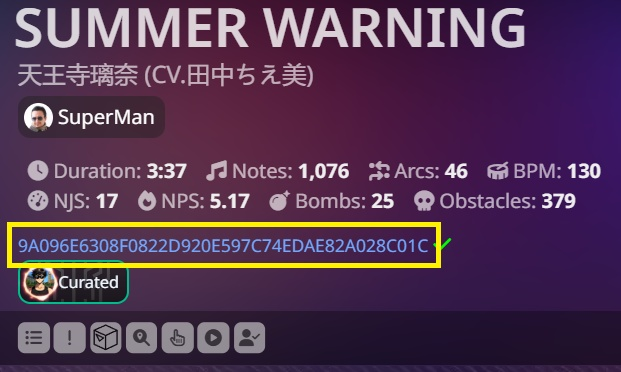 |
| **プラットフォーム** <small>*Platform*</small> | プレイヤーが立つ足場や周囲のステージ環境。<a href="#Environment">Environment</a>と同義で使われるか、カスタムプラットフォームModによるものを指す。 |
| **フラワーノーツ** <small>*Flower Note, Star Note*</small> | ノーツを45度違いで重ねて配置したもの。花(?)のような見た目をした特殊な配置。スターノーツともいう。 色違いや矢印ノーツであれば難度の高い特殊配置だが、同じ色のドットノーツであれば（特殊なことに変わりはないが）使用しやすい。 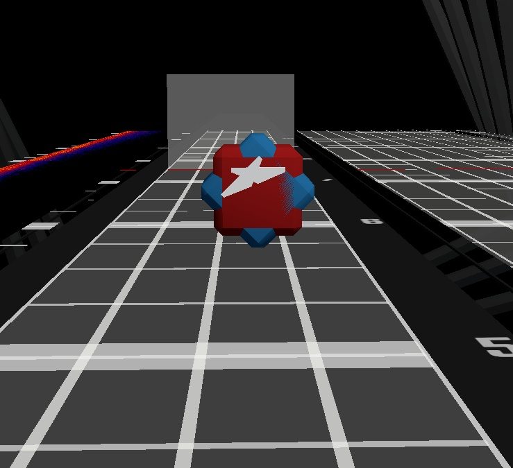 |
| **フリック** <small>*Flick*</small> | ノーツが2個連続した、手首のスナップを使って素早く弾くように切る配置。高難度配置。 基本的には1/4ビート間隔（またはそれに近い速さ）で置かれた2連続ノーツが該当する。 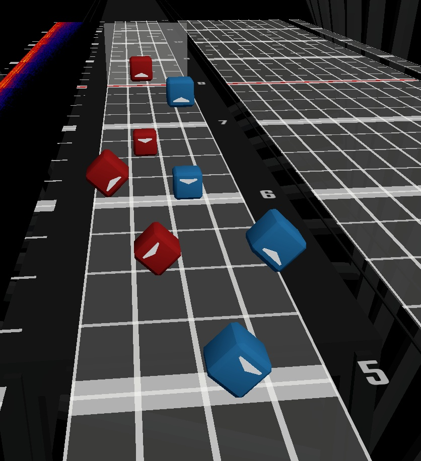 |
| **フルスプレッド** <small>*Full Spread*</small> | EasyからExpertPlusまで、標準的なすべての<a href="#難易度">難易度（Difficulty）</a>が網羅されていること。およびその譜面。 Standard区分での難易度が揃っていることが本質であり、例えばコラボ等でEx+が2つありEasyが欠けている5難易度展開はフルスプレッドとはならない。 |
| **プレイアビリティ** <small>*Playability*</small> | 譜面の「遊びやすさ」のこと。ノーツ配置に無理がないか、視認性が悪くないか、理不尽なミスを誘発しないかなど、気持ち良くプレイする為の品質。 |
| **フロー** <small>*Flow*</small> | 文字通り、ノーツからノーツに繋がるセイバーの「流れ」。スムーズにスイングが繋がる譜面やパターンは「フローが良い・気持ち良い」と評価される。 多くの場合は動きのある譜面でそのスムーズさを表す時に使われる為、極端な話「上下が連続するだけの譜面」はスムーズであるもののフローは単調であるとも言える。 |
| **プロネーション（回内）** <small>*Pronation*</small> | ① 前腕を「内側」にひねる動き（手のひらが下を向くような動き）のこと。またはその状態を指す。 ② <a href="#ScoreSaber">ScoreSaber</a>ランク基準では、「手のひらを下にした位置から約90°～100°まで腕を内側に回転させること」と定義されている。 ※「運動」を示す場合は一般的な1の意味で考えてよく、文脈次第では2の基準が用いられる場合もある 関連: <a href="#スピネーション（回外）">スピネーション（回外）</a> |
| **Heck** <small>*ヘック*</small> | <a href="#Chroma">Chroma</a>, <a href="#NoodleExtensions">NoodleExtensions</a>, <a href="#Vivify">Vivify</a>の前提Mod。 |
| **Verified Mapper** <small>*ベリファイドマッパー*</small> | コミュニティによって認定されたマッパー。高品質なマップを継続的に制作する能力があると審査によって認められた者たちであり、コミュニティの代表（お手本）として見なされる。 認定にはマッパー本人からの申請が必要で、いくつかの公開済みマップを提出し、審査が行われる。認定されるとdiscordロールがつき、<a href="#BeatSaver">BeatSaver</a>ではVerified Mapperを示す紫の帯が表示されるようになる。 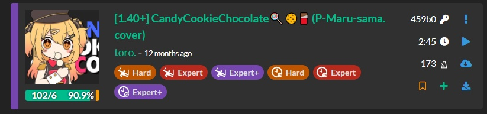 |
| **ポール** <small>*Paul*</small> | 同じ向きのノーツが真っ直ぐ1列に大量に連なっている配置。およびその譜面。 セイバーをゆっくりとスイングすることで一振りで切ることができるが、難易度は非常に高い。<a href="#バニラ">バニラ</a>で配置可能なノーツ配置。 ※英語表記はPoleではなく、Paulが正しい。 関連: <a href="#プードル">プードル</a> 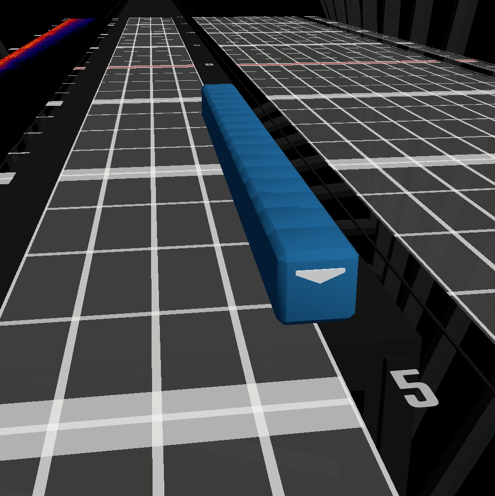 |
| **ホットスタート** <small>*Hot Start*</small> | 曲が始まってから最初のノーツ・ボム・壁よけが飛んでくるまでの時間が極端に短いこと。プレイヤーの準備が間に合わないため非推奨。 ※ランク基準では最低1.5秒、一般的には最低2秒の猶予を作ることが推奨されている |
| **ボム** <small>*Bomb*</small> | トゲトゲした黒い爆弾。セイバーが当たるとダメージを受けコンボが途切れる。 マッピングにおいては、音の<a href="#表現">表現</a>だったり、プレイヤーに緊張感を与えたり、プレイヤのセイバー位置を意図的に操作したり（<a href="#ボムリセット">ボムリセット</a>、<a href="#ボムホールド">ボムホールド</a>、<a href="#ボムスパイラル">ボムスパイラル</a>、<a href="#誘導">誘導</a>など）、多様な使い方で用いられる。 |
| **ボムスパイラル** <small>*Bomb Spiral/Helix*</small> | 螺旋状に配置したボムのこと。プレイヤーはセイバー（腕）をグルグルと円を描くように動かすことを強制される。 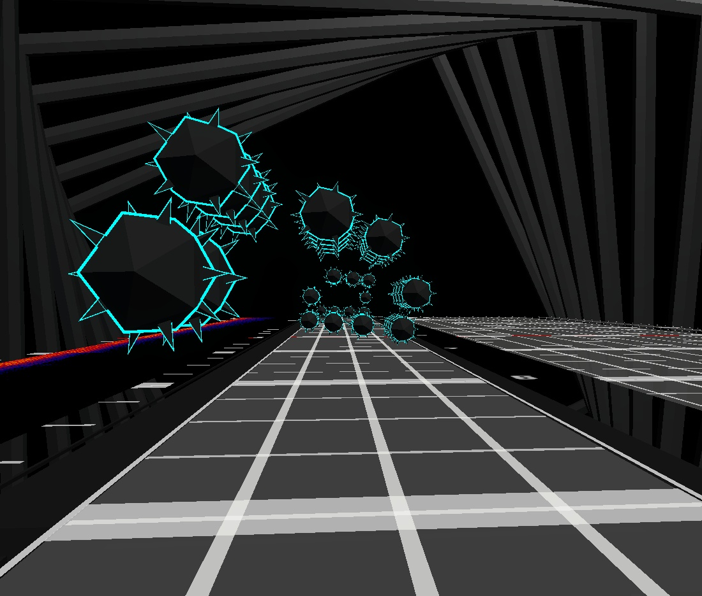 |
| **ボムホールド** <small>*Bomb Hold*</small> | 特定のノーツを切った後、プレイヤーのセイバーを一時的にそこから動かせないように（ホールド）制限するボムの配置。 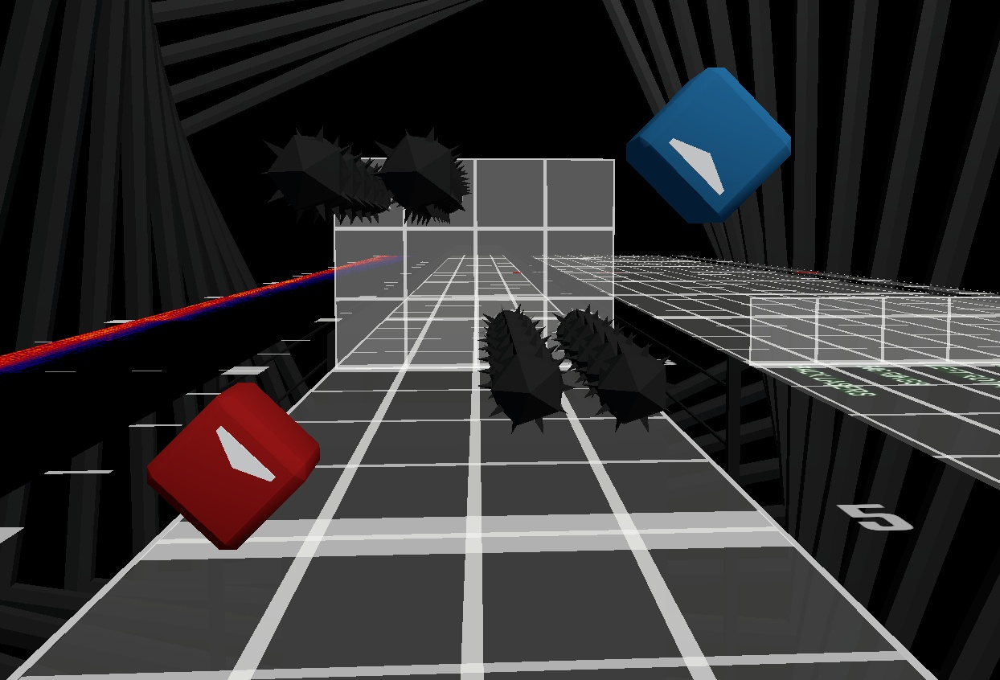 |
| **ボムリセット** <small>*Bomb reset*</small> | プレイヤーのセイバーのスイングを強制的に元の位置に戻させる（<a href="#リセット">リセット</a>させる）目的で配置されたボムのこと。略称は「ボムリセ」。 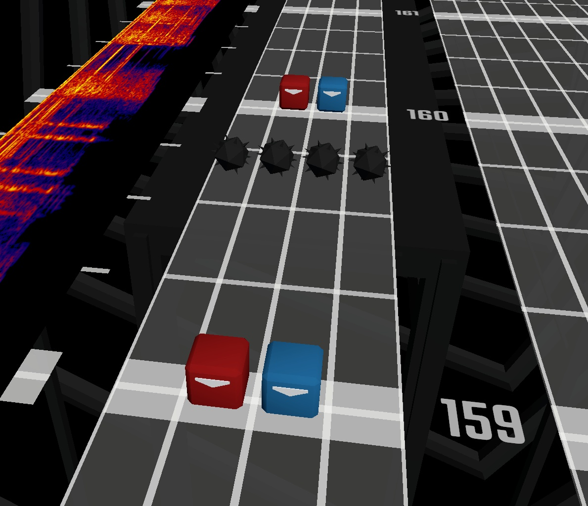 |

## マ行

| 用語 | 意味 |
| --- | --- |
| **巻き込み** <small>*※適する英語なし？*</small> | 狙ったノーツを切る際に、意図せず別の色のノーツまで一緒に切ってしまうミスのこと。ノーツ同士の配置が近すぎたり、スイング軌道上に別の色のノーツが被っている場合に発生しやすい。 巻き込みを誘発しやすい配置は巻き込み配置と呼ばれる。 |
| **マッパー** <small>*Mapper*</small> | 譜面（マップ）を作成する人のこと。 |
| **マッピング** <small>*Mapping*</small> | 楽曲に合わせてノーツ、壁、ボムなどを配置し、譜面（マップ）を作成する作業のこと。 |
| **マッピングアワード** <small>*Mapping Awards*</small> | <a href="#BeastSaber">BeastSaber</a>が主催する、その年の優れた譜面やマッパーを表彰する非公式の年間アワードイベント。ノミネートは全プレイヤーからの推薦によって決まり、表彰は一般投票、ベテランマッパーチームによる投票などで決定される。 正式名称はBeastSaber Mapping Awards。別名Beasties。 |
| **MappingExtensions** <small>*マッピングエクステンション*</small> | ノーツや壁を、通常の規格外の場所・角度で置けるようにできる、元祖マッピング拡張Mod。 ※現在でも使用可能だが、<a href="#NoodleExtensions">NoodleExtensions</a>が後継のような存在なので通常はそちらが推奨される |
| **マッピングエディタ** <small>*Mapping editor*</small> | 譜面を作成するためのソフトウェア。現在は<a href="#ChroMapper">ChroMapper</a>が主流。<a href="#公式エディタ">公式によるエディタ</a>もある。 |
| **マップ（動詞）** <small>*Map*</small> | ノーツ、ボム、壁を「配置」すること。配置しない場合はアンマップ（unmap）。 「ここの音はマップしたほうがいい」「ここは音が無いからアンマップすべきだ」等 |
| **Map of the Week** <small>*マップオブザウィーク*</small> | <a href="#BeastSaber">BeastSaber</a>で毎週選出される「今週のベストマップ」。<a href="#キュレーター">キュレーター</a>の推薦によって選出される。 譜面の品質はもとより、楽しさ、下位難易度の有無、手製のライティング、などなど総合的なクオリティで評価される。間違いなく多くの人にオススメできる譜面といえる。 |
| **マップチェッカー** <small>*Map Checker*</small> | 譜面におけるマッピングのミス、問題のある配置、その他色々なチェックを行ってくれるツールの総称。<a href="https://kivalevan.me/BeatSaber-MapCheck/" target="_blank">Kivalマップチェッカー</a>、<a href="#ChroMapper">ChroMapper</a>プラグインである<a href="https://github.com/LightAi39/ChroMapper-AutoModder" target="_blank">AutoModder</a>がよく使用されるマップチェッカーである。 不慮の<a href="#ミスマップ">ミスマップ</a>などを避け、譜面をより良くする為にも、公開前には必ずチェッカーに通しておきたい。 |
| **マップフォーマット** <small>*Map Format*</small> | 譜面（難易度ファイル）のデータ構造の規格。譜面形式。 難易度ファイルにはversion4.1.0、といったようにバージョンがつけられており、ゲームに大きなアップデートがあった場合は頭の数字が上がり、それをもって<a href="#V4マップ">V4マップ</a>などと呼ばれる。 バージョンが上がると仕様が変わるほか、アーク・チェインや<a href="#VNJS">VNJS</a>などのように譜面に新要素が追加されることが多い。新要素は基本的に古いゲームバージョンと互換性が無く、例えばV4マップのVNJS機能は1.40未満では機能せず、また、V4マップそのものは1.34.5未満ではプレイすること自体できない。 現在はV2,V3,V4の3バージョンがプレイ可能であり、バージョンの数字は難易度ファイルを直接開くことで確認できる。 <a href="https://note.com/toro_desu/n/nc44cf87adc04" target="_blank">解説記事</a> |
| **◯◯テック** <small>*-*</small> | 以下は、わりと雰囲気で語られることが多く、定義がふんわりした側面もあることから、参考程度に記載させていただく。 **アングルテック**: 角度変化が主体であるテック譜面 **ギミックテック**: 今までにないような、ユニークなテックパターンをコンセプトとしたテック譜面 **回転テック**: 手や腕を回す勢いで<a href="#フロー">フロー</a>を構成するテック譜面。<a href="#モメンタム">モメンタム</a>テックとも |
| **ミスマップ** <small>*Mismap*</small> | 配置ミスを指す。コピペミス、誤クリック、誤削除などなど |
| **ミッドスピード** <small>*Mid Speed*</small> | BPMが遅すぎず速すぎず、ほどほどの密度を切らせる中速帯の譜面。 <a href="#リニア">リニア</a>なものもあれば、テック寄りのものもある。 |
| **ミラー（配置）** <small>*Mirror*</small> | 作成済みの配置をミラー反転すること。どのエディターでもデフォルトで利用可能な機能であり、<a href="#一貫性">一貫性</a>を保ったままお手軽に変化をつけてコピペすることができる為、同じパートの繰り返しなどでよく利用されるマッピング技法である。 |
| **Modding** <small>*モッディング、モディング*</small> | ① ゲームにModを導入すること。 ② ランク譜面化の為の<a href="#Mod">Mod</a>作業を行うこと。モディング、モッディング。 ランク化の為の必須プロセスである。 |
| **Mod** <small>*モッド*</small> | ① 有志によって開発された、ゲームに新機能を追加したりシステムを変更したりする非公式の拡張プログラム。 ② ランク譜面化を目指す際、Modder（添削する専門の人）が譜面を詳細にチェックし、ランク基準に基づき配置や音取りなどの修正要求を行う作業のこと。語源はリズムゲーム「osu!」の同様の文化から。 |
| **ModAssistant** <small>*モッドアシスタント*</small> | 過去に主流だったMod導入ツール。現在も利用可能であるものの、<a href="#BSManager">BSManager</a>の利用が推奨されている。 |
| **Modchart** <small>*モッドチャート*</small> | Modの<a href="#NoodleExtensions">NoodleExtensions</a>を使い、ノーツの軌道アニメーションを曲げたりノーツを消したりプレイヤーを動かすなど、視覚演出や特殊なプレイ体験に特化した譜面。<a href="#Chroma">Chroma</a>や<a href="#Vivify">Vivify</a>が併用されることも多い。 Modを使ったChart（譜面）＝Modchart |
| **モメンタム** <small>*Momentum*</small> | セイバーを振った時に生まれる物理的な「勢い」。主に、腕や手による遠心力や重心移動での勢いを指し、その勢いを推進力に使って大きく角度変化させるテック配置は回転テック・モメンタムテックとも呼ばれる。<a href="https://beatsaver.com/profile/4234943" target="_blank">GojiCrafter</a>のテック譜面がその例としてとてもわかりやすい。 |

## ヤ行

| 用語 | 意味 |
| --- | --- |
| **誘導** <small>*※適する英語なし？*</small> | 次のパターンを無理なく切れるように、直前までの配置を工夫して次の配置へ自然に導く流れを作ること。 ※「<a href="#セットアップ">セットアップ</a>」とほぼ同義であり使用ケースもほぼ被っているが、こちらはプレイヤーに動きの「道筋」を示すニュアンスが強い。例えば「大胆な腕の移動をさせる配置をわかりやすくする為に、ボムやアークを置いて誘導を強める」など。 |

## ラ行

| 用語 | 意味 |
| --- | --- |
| **ライター** <small>*Lighter*</small> | ライトを作成する人のこと。 <a href="#V4マップ">V4マップ</a>からはマッパーとライターそれぞれ分けてクレジットできるようになった。 |
| **ライティング** <small>*Lighting*</small> | 背景のライトなどの照明演出。または、それらライトを配置して作成する作業のこと。 |
| **Lightshow** <small>*ライトショー*</small> | ① ライティング観賞用の<a href="#ゲームモード">ゲームモード</a>（<a href="#Characteristic">Characteristic</a>）。非公式のモードであり、<a href="#SongCore">SongCore</a>によってサポートされる。 ノーツを置かずに、ライトや<a href="#ウォールアート">ウォールアート</a>を鑑賞するために用意される難易度。ノーツが配置できないわけではない。 ※モディファイアのZenモードを使うことで通常難易度でもライトだけを鑑賞できる。 ② ライティング(照明演出)の言い換え。「素晴らしいライトショーだ」 |
| **ランク譜面** <small>*Ranked map*</small> | <a href="#ScoreSaber">ScoreSaber</a>や<a href="#BeatLeader">BeatLeader</a>のランク化プロセス(<a href="#Modding">Modding</a>)を完了し、ランク対象として認められた譜面。星評価（Star Rate）という独自の難易度指標が与えられ、星の数値が高いほど難しいとされる。クリアすることで<a href="#PP">PP</a>が得られる。 |
| **ランダム（ランダム性）** <small>*random*</small> | 配置パターンや<a href="#強調">強調</a>の<a href="#一貫性">一貫性</a>に欠け、まとまりがなく配置された様。 |
| **リアクションタイム** <small>*Reaction Time*</small> | ノーツが出現してからプレイヤーに到達するまでの時間。<a href="#NJS">NJS</a>と<a href="#JD">JD</a>（<a href="#HJD">HJD</a>）の設定によって決まる。略してRT。 プレイヤーがノーツを認識してアクションを行う為の猶予時間と言い換えることもでき、譜面のJD（HJD）を設定する際は「想定するプレイヤー層がそのリアクションタイムで反応できるか」が一つの判断材料になる（特に低難度譜面においては）。 JDFixerなどのModを使うことで、プレイヤー側でリアクションタイムを直接指定してプレイすることも可能。 |
| **リーン** <small>*Lean*</small> | プレイヤーの身体を斜め・横方向に傾けさせることを意図した配置<a href="#フロー">フロー</a>。または、傾く行為そのもの。 |
| **リストロール** <small>*Wrist Roll*</small> | 手首（リスト）を回すように滑らかに捻ること。またはその動きで処理する配置パターン。テック譜面などで頻出。 例えば、同じ向きのノーツは通常では<a href="#DD">DD</a>だが、<a href="#パリティ">パリティ</a>の保たれたテック譜面であれば、1個目を<a href="#フォアハンド">フォアハンド</a>→2個目を<a href="#バックハンド">バックハンド</a>、といったように手首を捻って（リストロールで）処理することが正しい切り方となる。 |
| **リセット** <small>*Reset*</small> | プレイヤーが何もないところでセイバーのスイングを戻して、ニュートラルのポジションに戻す行為。 <a href="#パリティ">パリティ</a>を遵守した譜面を作る為には、マッパーはリセットを要する配置は含んではならない。 ※初心者向けである低難易度や、ボムを伴う<a href="#ボムリセット">ボムリセット</a>、特殊な譜面などは例外 プレイヤー目線では、意図的にリセットすることでテック譜面を強引に攻略するテクニックも存在する。 |
| **リニア** <small>*Linear*</small> | 曲線的・並行的な動きが無く、直線的なノーツ配置であること。 関連: <a href="#リニアスピード">リニアスピード</a> |
| **リニアスピード** <small>*Linear Speed*</small> | 直線的な配置で（直線的なジャンプで）作られたスピード譜面。純粋なスピード対応力が求められる。 関連: <a href="#リニア">リニア</a> |
| **リパブリッシュ** <small>*Republish*</small> | 一度公開した譜面のエラーや配置を修正し、再度アップロードして公開し直すこと。略してリパブ。 リパブリッシュするとその時点でリーダーボードはまっさらな状態になる。※過去のリーダーボードが完全に消えるわけではなく、譜面のバージョン（<a href="#譜面ハッシュ">譜面ハッシュ</a>）ごとにリーダーボードが生成・管理される仕組み 関連: <a href="#パブリッシュ">パブリッシュ</a> |
| **ReMapper** <small>*リマッパー*</small> | プログラミング（TypeScript）を用いて、譜面をコードベースで効率的に作成・編集するためのフレームワーク。<a href="#Chroma">Chroma</a>や<a href="#NoodleExtensions">NoodleExtensions</a>、<a href="#Vivify">Vivify</a>等を用いた<a href="#Environment">Environment</a>の改造、複雑なライト演出や空間演出などを、コードを書くことで効率化・高度化できる。 |
| **レーン** <small>*Lane*</small> | ノーツが配置される4x3グリッドの縦の列。通常では4列存在する。 特定レーンを指して中央（インナー）レーン、外（アウター）レーンなどと呼ばれることも。 |
| **Legacy** <small>*レガシー*</small> | 過去の譜面をリメイクする際などで、古い難易度を残しておく為に使用する公式の<a href="#ゲームモード">ゲームモード</a>（<a href="#Characteristic">Characteristic</a>）。 他のモードと違って何か独自の遊び方があるわけではないので、古いことを明示的する為の譜面置き場であり、使い方は自由。 |
| **Lawless** <small>*ロウレス*</small> | Standard等と並ぶ、譜面に用意される<a href="#ゲームモード">ゲームモード</a>（<a href="#Characteristic">Characteristic</a>）の1種。非公式であり、<a href="#SongCore">SongCore</a>によってサポートされる。 ”無秩序”の意味が示す通り、なんでもありな譜面を置くため（それを明示的にするため）の難易度。 |
| **ローテック** <small>*Low Tech*</small> | テック譜面の中でも、ノーツ密度が抑えめで、複雑さや難解さが比較的控えめなスタイル。テック特有の要素はありつつ、多くの人がプレイできる。 |

## ワ行

| 用語 | 意味 |
| --- | --- |
| **OneSaber** <small>*OneSaber*</small> | 片手のセイバーのみを使ってプレイする公式の<a href="#ゲームモード">ゲームモード</a>。 このモードで譜面を作った場合、プレイヤーのセイバーは右手側しか表示されない（プレイヤーがレフティーをオンにすることで左手に対応）。 |

---

## クレジット

* **作成者:** toro 
<a href="https://x.com/ge2toro" target="_blank">X (Twitter)</a>
 <a href="https://note.com/toro_desu" target="_blank">note</a>
 <a href="https://discord.gg/gfKQkgcpmE" target="_blank">Discordサーバー(mapping group)</a>
 <small>私が管理しているマッピング全般を扱うサーバーです。当用語集について話し合うチャンネルもあります。</small> 

* **参考サイト:** 
この用語集の作成にあたり、以下のサイトも参考にしています。
 <a href="https://bsmg.wiki/" target="_blank">BSMG Wiki</a>
 <a href="https://wiki.scoresaber.com/" target="_blank">ScoreSaber Wiki</a>
 <a href="https://beatleader.wiki/en/home" target="_blank">BeatLeader wiki</a>

* **最終更新日:** 2026年04月21日